# Turboslide

Turboslide is an agent native slides editor with Google Slides' structure and behaviours in the Prototemplate look. A deck is a block document: a manifest plus one JSON file per slide plus assets with light and dark twins, validated by one schema and checked by a grammar linter. One framework free renderer turns that document into the same HTML and CSS everywhere, so the browser editor, the static viewer, the embed, the CLI's screenshots and the exporters draw from one source and a render at revision N is the same pixels on every surface. Every slide is a canvas: every object drags, resizes, rotates, groups and reorders as it does in Google Slides, and the GT brand layouts are the templates a canvas re-flows by. Every operation is a named action in one table, from which the CLI, the MCP server, the HTTP API, the in-page window API, the OpenAPI document and the agent skills are generated, so a person's click and an agent's call take the same path through the same validator. Export is perfect PPTX: each page is the rendered slide over a searchable text layer, measured against the web render before the file is written, with an editable text mode beside it. The studio is hosted at [https://turboslide.vercel.app](https://turboslide.vercel.app).


_The root of the hosted studio redirects to `/new`, a fresh presentation that is created in the store on its first edit._

- Live studio: [https://turboslide.vercel.app](https://turboslide.vercel.app)
- Documentation: [docs/README.md](docs/README.md) and the index at the end of this page
- Rules for working in the repository: [AGENTS.md](AGENTS.md)
- License: MIT ([LICENSE](LICENSE))

## Contents

- [Feature tour](#feature-tour)
  - [The Google Slides shell](#-the-google-slides-shell)
  - [The canvas](#-the-canvas)
  - [Layouts and themes](#-layouts-and-themes)
  - [Text](#-text)
  - [Objects, pictures and materials](#-objects-pictures-and-materials)
  - [Tables](#-tables)
  - [Charts and diagrams](#-charts-and-diagrams)
  - [Exports](#-exports)
  - [Present](#-present)
  - [The viewer and sharing](#-the-viewer-and-sharing)
  - [Home and files](#-home-and-files)
  - [Agent native](#-agent-native)
  - [Quality gates](#-quality-gates)
  - [Hosting](#-hosting)
- [Getting started](#getting-started)
- [The CLI in brief](#the-cli-in-brief)
- [Architecture](#architecture)
- [Documentation](#documentation)
- [License](#license)

## Feature tour

### 🪟 The Google Slides shell

The editor at `/edit/:deckId` (and the draft at `/new`) has Google's frame: a title row, a menu bar, a toolbar whose tail follows the selection, the filmstrip on the left, the canvas with the speaker notes pane under it, the right panels and a bottom bar. The chrome is the Prototemplate viewer shell ported as source, with its tokens, its 1 px line law and Inter at 13 px.

- 🪪 The title row holds the GT mark as a link to the home page, the title field (click to rename, Enter commits, Esc restores), the save state in words (All changes saved, Saving, Not saved yet, Couldn't save, retrying), the Last edit clock that opens Version history, the Slideshow split button and Share.
- 📑 Ten menus: File, Edit, View, Insert, Format, Slide, Arrange, Tools, Extensions and Help. Every Google menu item is in the menu model with a status: 270 are implemented and sit in Google's position, 22 are shown disabled with a tooltip reading "Not available in Turboslide yet" and one sentence on what to do instead, and 46 that need accounts, comments, animations, video or a Google service are left out.
- 🧰 The toolbar has a fixed head (Search the menus, New slide with the layout arrow, Undo, Redo, Print, Paint format, the Zoom box) and a contextual tail for a text box, a shape, an image, a line, a table cell, a chart or a group. At or below 1100 px the tail collapses into a More button.
- 🎞️ The filmstrip shows one 16:9 card per slide with its number, ringed when current, at 40 percent opacity with an eye-slash glyph when skipped, with section labels between groups. Shift+click and Cmd+click select several cards, drag reorders within and across sections, and the arrow, Home, End and Page keys move through it.
- 📝 The speaker notes pane sits under the canvas, resizes by its handle, hides on request and takes focus with Cmd+Option+Shift+S. Notes stay out of the viewer, the embed and every download unless asked for.
- 📟 The bottom bar toggles the filmstrip and the grid view and reopens the last right panel.
- 🧭 The right panel shows one of Format options, Themes, Version history, Check slides, Change history, Pictures and materials or Diagram at a time, 320 px wide, opened from a toolbar button, a menu item or a right-click item.
- 🔍 Search the menus (Option+/) filters every menu item by label, menu path and key, and Enter runs it.
- ⌨️ The Keyboard shortcuts dialog (Cmd+/) lists Google's chords under Google's groups with a search box; the chords the editor binds are Google's (Ctrl+M new slide, Cmd+D duplicate, Cmd+Shift+H find and replace, Cmd+Option+Shift+F and +C for the filmstrip and the canvas, and the rest of the table in the parity specification).
- 💬 Every control, menu item, handle and chip carries a tooltip with its name, one sentence on what it does and its key; `scripts/tooltip-audit.mjs` walks the built pages and their menus and fails on a miss.
- 🖱️ Right-click menus open on a filmstrip card, on the empty canvas and the workspace around the sheet, on a text box, a shape, a line, an image, a group, a chart, a table cell or a cell range, and on a guide line, each with Google's rows.
- 🌗 The presentation has an appearance, light or dark, chosen in the Themes panel; the stage, the thumbnails, the slideshow, the viewer and the download default follow it. View > Appearance sets the chrome alone (Light, Dark or Match the presentation), stored per browser.
- 🫥 View > Full screen (Ctrl+Shift+F), or the Hide the menus chevron at the right of the toolbar, hides the menu bar and the toolbar; Esc restores them.
- 🔔 Snackbars carry one sentence and at most one action, usually Undo ("Slide deleted · Undo", "Moved to trash · Undo").
- ⏪ Undo and redo (Cmd+Z, Cmd+Y or Cmd+Shift+Z) walk a history where every gesture is one write and one entry, and external writes from an agent arrive in the open editor within a second with a banner naming the revision and the author.

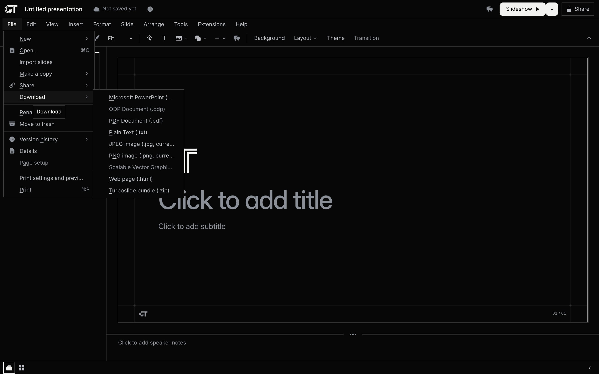

_File > Download lists the formats; ODP and SVG are present as disabled entries with their tooltips._

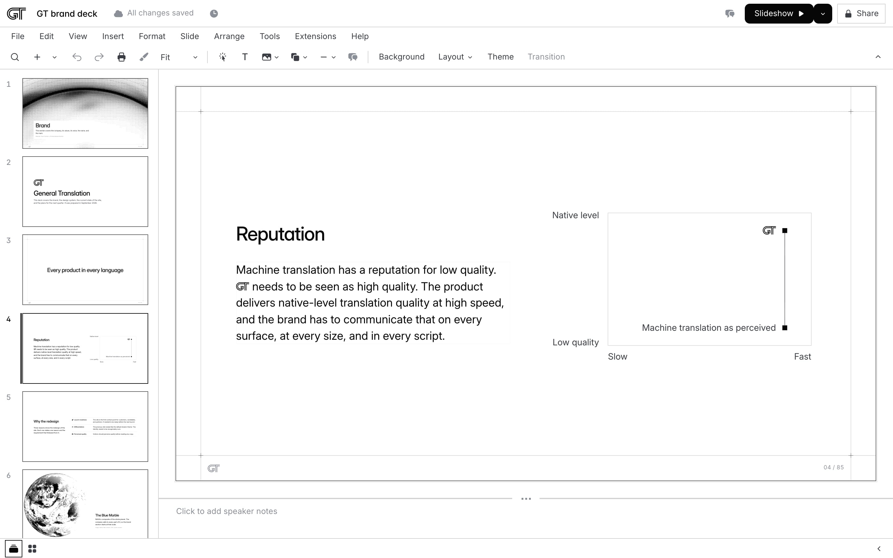

_The same editor on the paper ground, set through View > Appearance > Light._

### 🎨 The canvas

Every slide is a canvas. The layout's own text, the photograph of an opener or a mood slide, the plate, the mark, pictures, shader materials, shapes, lines, tables, charts and diagrams are objects a person drags, resizes, rotates, groups, duplicates, deletes and edits in place.

- 🧲 The first drag, resize, rotation, reorder or insert on a slide converts it losslessly to the freeform layout: every object takes the position box it is drawn at, measured on a rendered sheet at 1/64 px, and the conversion travels in the same write as the gesture, so one undo restores the grammar slide. The measured positions are identical between the editor, the CLI and the hosted studio in Chromium, and `pnpm check` proves the conversion changes at most 0.5 percent of pixels on every slide of the GT deck and the templates.
- ↔️ Drag an object's frame to move it; Shift constrains the drag to one axis; Cmd+drag suppresses snapping; the arrow keys nudge 1 px and Shift+arrows 10 px.
- ↘️ Eight resize handles on every object; Shift keeps the aspect ratio; Option resizes about the centre; a size readout ("480 × 64") shows while the pointer is down; Cmd+Ctrl+B, I, J, K and W resize by one grid step from the keyboard.
- 🔄 A rotation handle above the object rotates it with a live angle readout; Shift snaps to 15 degrees; Option+Left and Option+Right rotate 15 degrees and Option+Shift 1 degree; Arrange > Rotate offers 90 degree turns and flips; Size & rotation in Format options takes a typed angle and flip buttons.
- 🧷 Snap guides appear along the edges and centres an object lines up with: other objects, the sheet's edges and centre, the deck's guides and the GT theme's rails, content box and column seams, within 6 px. Equal spacing guides show when the gaps match. View > Snap to switches the guides and the 8 px grid.
- 📏 View > Show ruler draws rulers in inches along the top and left of the stage with the selection's extent shaded and the pointer's position marked; a drag out of a ruler creates a guide.
- 📐 Guides: View > Guides adds a vertical or horizontal guide at the slide centre, a guide drags with its position in inches, a right-click deletes it, and Clear guides removes them all. Guides are stored on the deck, shown on every slide in the editor and never in a thumbnail, the slideshow or a download.
- 🔎 Zoom: the Zoom box takes Fit, 50%, 100%, 200% or any value from 25 to 1600 percent; Cmd+plus and Cmd+minus step the ladder; Cmd+0 is 100 percent; Cmd+scroll and a trackpad pinch zoom about the pointer.
- 🖐️ Pan: the stage scrolls while zoomed and Space+drag pans it.
- 🔲 Marquee: a drag on the empty sheet or the workspace around it selects every object it crosses; Shift+click and Cmd+click add and remove objects; Tab and Shift+Tab cycle the objects in paint order; Esc steps back from the caret to the object to nothing.
- 🗂️ Z order: Cmd+Up, Cmd+Down, Cmd+Shift+Up and Cmd+Shift+Down, or Arrange > Order, move an object through one stack per slide that includes the background photograph, so Send to back puts anything behind it.
- 👥 Groups: Cmd+Option+G groups two or more objects, Cmd+Option+Shift+G ungroups, Regroup restores the last ungrouped set. A group moves, resizes (scaling every member about the union), rotates, flips, orders, aligns, deletes and duplicates as one; a fill, border, dash, shadow or text write applies to every member that has the field; a double click selects one member.
- 📋 Cmd+D duplicates the selection 16 px right and down on top of the stack; Option+drag drags a copy; Cmd+C, Cmd+X and Cmd+V move objects between slides through the clipboard, keeping their size and position.
- ✂️ Crop mode: a double click on a picture, the toolbar's Crop image or Format > Crop image enters it; eight black handles trim the picture, a drag inside pans it, Enter or a click outside commits, and the Mask arrow opens the shape picker.
- 🔗 Connectors: while a line tool is armed, or an end handle of a line is dragged, the connection sites of the shape under the pointer show as rings and the end snaps to one; the line then follows that shape when it moves, resizes, rotates or flips, and a drag of an end onto another shape reroutes it.
- ✏️ Draw tools: a text box, a shape preset, a line kind, a table or a chart is armed from the toolbar or the Insert menu; a click places the default size, a drag draws the box; Shift constrains a shape to a square and a line to 45 degree steps; Curve and Polyline take a click per point; Scribble samples the pointer; Esc cancels.
- 📌 Arrange > Align (six edges), Distribute (horizontally and vertically) and Center on page work on every slide kind; with one object selected Align uses the slide as the reference.
- 🗑️ Delete and Backspace remove every selected object in one write, the background photograph and a plate's blocks included.

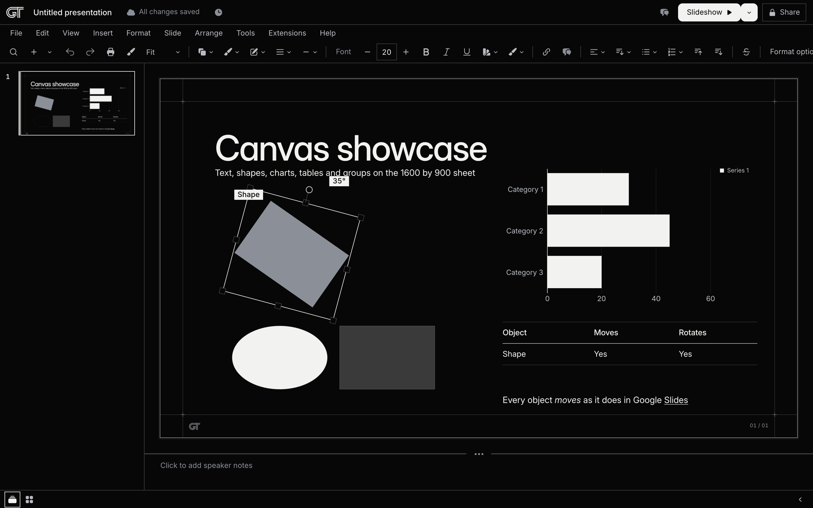

_Rotation by the handle, with the angle readout and the ring following the box._

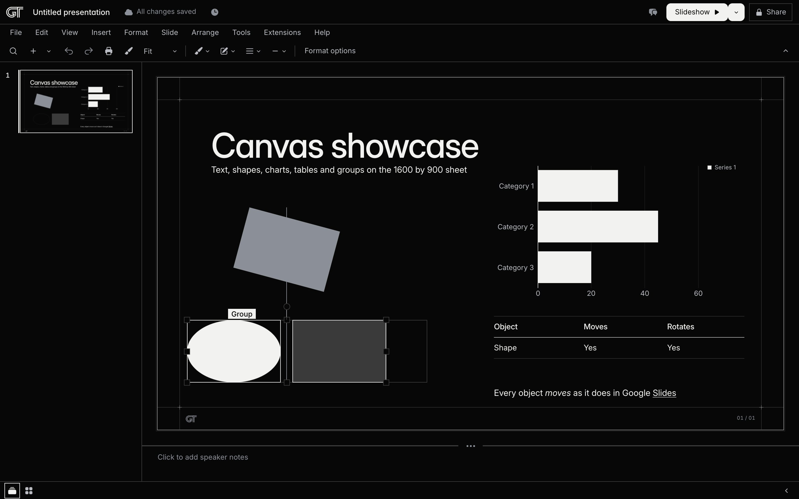

_A group dragged into alignment: the snap guide runs through both centres and the members move as one._

### 🧩 Layouts and themes

- 🧱 21 layouts in one list, shown in four places: the New slide arrow, the toolbar's Layout button, Slide > Apply layout and the filmstrip's Apply layout submenu. The first eleven are Google's, in Google's order: Title slide, Section header, Title and body, Title and two columns, Title only, One column text, Main point, Section title and description, Caption, Big number, Blank. After a rule reading "GT layouts" come Ruled rows, Ruled statement list, Title and table, Figure, Pair of figures, Tile grid, Detail grid, Status board, Matrix and Closing.
- ➕ New slide (Ctrl+M, the plus button, Insert > New slide, Slide > New slide, the filmstrip menu) inserts the current layout after the current slide with empty placeholders and selects it; the arrow opens the layout grid, whose tiles are rendered thumbnails of each layout in the deck's appearance.
- 🔁 Apply layout moves the title, the body, the lists, the tables and the pictures of a slide into the new layout's placeholders and appends the rest; it never refuses, it works on several selected slides in one write, it re-flows a canvas slide by the same table, and only a Title slide or a Main point drops what does not fit, naming it in the snackbar with Undo.
- 🏷️ A layout's placeholders are empty texts. The editor shows the prompt ("Click to add title", "Click to add subtitle", "Click to add a number", "Add a caption", "Click to add text") in them; thumbnails, the slideshow, the viewer and every export draw nothing for an empty text, and the linter's `copy/empty-placeholder` names the unfinished ones.
- 🎨 The Themes panel (Slide > Change theme, the Theme button, the filmstrip's Change theme) shows the GT theme with Light and Dark thumbnails; a click writes the presentation's appearance, and the stage, thumbnails, slideshow, viewer and download default follow it.
- 🖌️ The theme is `gt-ink-paper`: a 1600 by 900 sheet with two rails and two rules, nine tokens with a pure dark remap, Inter as the only face (weights capped at 500 for display), the type ladder from 88 px down to 15 px, ruled rows and lists instead of bullets by default, and the copy rules of the GT brand deck as lints.
- 🆕 The root of the studio is a fresh presentation: `/` redirects to `/new`, which shows an Untitled presentation on the Title slide; the deck is created in the store on the first edit and the address becomes `/edit/<id>`. A presentation still called Untitled takes its title from the title slide's heading when that heading is first committed.
- 🖼️ Every new presentation carries four theme starter pictures (two-tone twins from the GT deck), so Section header, Caption and Closing work at once; the figure layouts draw a dashed plate reading "Click to add a picture" until an asset is chosen.
- 📚 The GT brand deck, 85 slides in 8 sections, is the template on the home page and the record every layout was drawn from.
- 🔢 Insert > Slide numbers writes the counter mode (On, Off, Skip title slides) for the deck.
- 🧮 The grammar's block catalogue is available on every slide: heading, paragraph, credit, rows, plain, refs, say, scales, spec, lang, ladder, swatches, shot, pair, tiles, details, board, composite, panel, dia, dither, mark, matrix, logoPlates, material, box, shape, rule, text, icon, table, chart and picture, each with its properties and snap sets documented in [docs/grammar.md](docs/grammar.md).

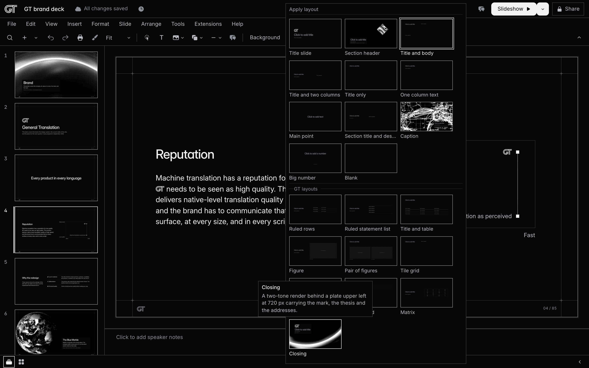

_The layout grid from the toolbar's Layout button, applied to every selected slide._

### 🔤 Text

- 🅱️ Marks on a range: bold (the display weight), italic (Cmd+I), underline (Cmd+U), strikethrough (Cmd+Shift+X), superscript (Cmd+.), subscript (Cmd+,), text colour and highlight colour. They are stored in the text markup as a mark span, `[text]{i u c:red}`, and Inter's italic faces were built into the export font set for them (34 static faces).
- 🔠 Format > Text > Capitalization rewrites a range in lowercase, UPPERCASE or Title Case, keeping marks and links.
- 📃 Lists: the ruled list is the default; Bulleted list (Cmd+Shift+8) offers nine glyph presets and Numbered list (Cmd+Shift+7) six numbering presets in a preset grid; items take levels 1 to 9 with Tab, Shift+Tab, Cmd+] and Cmd+[; Enter twice on an empty item leaves the list.
- ↕️ Line spacing offers Single, 1.15, 1.5 and Double, a Custom spacing dialog, and Add space before or after paragraph.
- 🧾 A text box flows in one, two or three columns.
- ⏩ Increase indent and Decrease indent step the left indent by 64 px.
- ↔️ Text aligns Left, Center, Right or Justified, sits Top, Middle or Bottom inside a positioned box, shape, text box or table cell, and takes four sided padding.
- 🔡 Font size steps along the type ladder (Cmd+Shift+> and Cmd+Shift+<), weights 300 to 700 with the 500 cap as a lint, letter spacing and line height steps.
- 🔣 Insert > Special characters opens a dialog with categories (Arrows, Punctuation, Currency, Math, Symbols, Emoji), a search by name over about 600 characters and a Recent row; a click inserts at the caret.
- 🖌️ Paint format (Cmd+Option+C, Cmd+Option+V) copies fill, border, dash, typography, colour, list marker and the caret's marks and applies them to the next click; a double click keeps it armed and Esc disarms it.
- 📐 Text fitting: Do not autofit, Shrink text on overflow (one ladder step per commit until the text fits) or Resize shape to fit text, per text box.
- 🔎 Find and replace (Cmd+Shift+H) with Match case replaces across every text, table cell and speaker note of the deck in one write, and reports the count.
- 🧹 Clear formatting (Cmd+\) removes typography, colour, fill and border overrides in one write.
- 🔗 Insert link (Cmd+K) on a selection or a block: a URL, or a slide in this presentation (Next, Previous, First, Last or any slide by title). Links travel into the PPTX as hyperlinks and slide jumps.
- ✒️ Inline editing: a click inside text places the caret, Enter starts a paragraph (a new item in a list, a commit in a heading), Esc commits and keeps the text, and the browser underlines misspellings.
- 🅰️ Insert > Word art shows an entry bar; Enter places the text at 88 px with an outline as an object on the sheet.

### 🔷 Objects, pictures and materials

- 🔶 Shapes: 135 presets in Google's four categories (Shapes 99, Arrows 26, Callouts 4, Equation 6), from rectangles and flowchart symbols to stars, banners, block arrows and callouts, each drawn from the ECMA-376 preset geometry so the sheet and PowerPoint agree. A shape holds text, its adjust handles (a callout's pointer, a corner radius) are fields in Format options, and Change shape swaps the preset.
- 🎨 Shapes, boxes, pictures, lines and table cells take a fill colour, a border colour, a border weight from 1 to 4 and a border dash (Solid, Dot, Dash, Dash dot, Long dash, Long dash dot). A colour is a theme token first (ink, paper, ink-2, titanium, hair, hair-soft, plate, edge) or one of the four semantic hues (green, amber, red, GT blue); a custom hex is allowed and marked by the `color/off-palette` lint.
- 🌫️ A drop shadow with colour, transparency, angle, distance and blur applies to boxes, shapes, text boxes, pictures, icons, tables and charts.
- ➖ The line tools are Line, Arrow, Elbow connector, Curved connector, Curve, Polyline and Scribble; each end takes one of nine decorations (filled and open arrows, stealth, circle, square, diamond) or none, and a line has a weight, a dash and, on a connector, a bend.
- 🖼️ Insert > Image takes Upload from computer, By URL or From this presentation; a picture can be replaced, cropped, masked to any closed shape preset, adjusted (transparency, brightness, contrast), reset, framed with a weight, colour and dash, and given alt text. Every asset records its source, artist, license and credit, and the linter checks licenses and share-alike credits.
- 🌄 Backgrounds: Slide > Change background opens the Background dialog with Color, Image (Choose), Reset to theme and Add to theme. A background picture is a picture object at the bottom of the stack that moves, resizes and crops like any picture; Add to theme writes the colour every slide without its own takes.
- ✳️ Icons: Insert > Icon opens a picker over the theme's sprite (67 Heroicons 20 solid plus the GT mark) and inserts an icon block at 16 to 96 px in a palette colour.
- 🌈 Shader materials: Insert > Material lists 17 Paper Shaders (liquid metal, mesh gradient, god rays, dot grid, waves, smoke ring, metaballs, grain gradient and more) with typed uniforms and palette presets. A material plays live on the stage, resizes with its box, and is captured as frozen frames at 3200 by 1800 with a recipe key for the thumbnails and the exports (`turboslide material capture`).
- ⬛ Dithered pictures: the two-tone pipeline of the GT brand deck (crop, cover fit, tone with black and white points and gamma, an 8 by 8 Bayer screen at 2 px cells, an inverted light twin) runs on a photograph or a captured frame, reports its plate clearance, and is implemented three times with the same arithmetic: TypeScript, a Rust napi addon and a wasm module, with a parity test that proves they light the same cells.
- 📸 Page captures: `turboslide asset capture` shoots a web page at 1440 by 900 in both themes through a per site recipe, with detail crops as further assets.
- 🏷️ Alt text on every object (Cmd+Option+Y): on the block for a shape, chart, line or text box, on the asset for a picture, so two pictures of one asset share one description.
- 🧰 Five primitive blocks, box, shape, rule, text and icon, take fill, stroke, radius, padding, colour and typography and sit beside the shape presets on any slide.

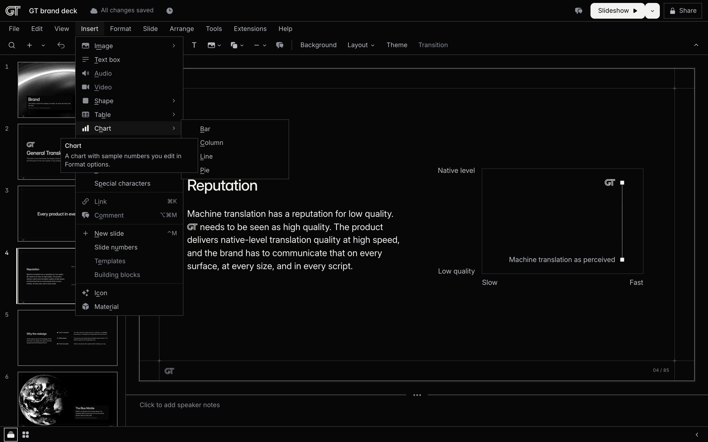

_The Insert menu on a content slide of the GT brand deck._

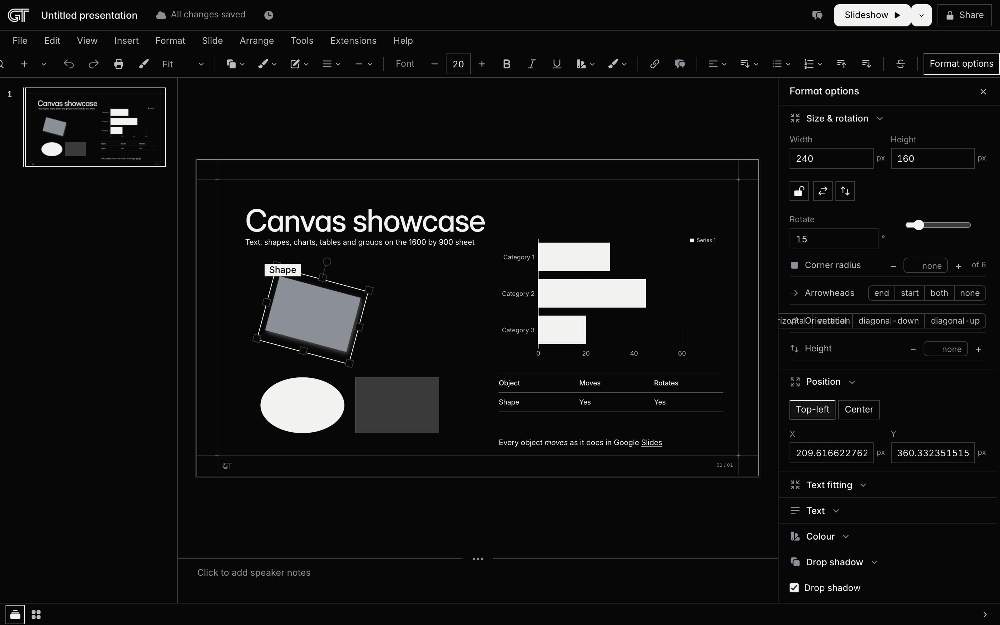

_Format options, the right panel, with the sections Google names for the selected object._

### 📋 Tables

- 🔢 Insert > Table opens a hover grid up to 20 by 20; the pick inserts a table as an object centred on the sheet.
- ➕ Insert row above, Insert row below, Insert column left and Insert column right (with counts), Delete row, Delete column and Delete table, from Format > Table, the cell's right-click menu and the CLI.
- 🔀 Merge cells over a range and Unmerge cells; merged cells travel into the PPTX as row and column spans.
- ↔️ Distribute rows and Distribute columns even out a table; each row has a height, each column a width and an alignment, and the first row can be a header.
- 🎨 Each cell or column takes a fill and a border (colour, weight, dash; weight 0 is a transparent border), the table takes a border colour and dash, and cells align vertically.
- 🧭 Tab moves between cells, a double click opens the caret in a cell, and Enter starts a paragraph inside one.
- 📤 The Editable text export writes a native PPTX table (`a:tbl`) with the measured column widths, row heights and line pitch, verified cell by cell against the web render; the GT grammar's ruled rows keep their hairline construction.

### 📊 Charts and diagrams

- 📊 Insert > Chart inserts a Bar, Column, Line or Pie chart with placeholder data at 960 by 540; a chart takes up to 12 categories and 6 series.
- 🧮 Chart data in Format options is a grid: the categories in the first column, one column per series with its name and colour swatch, Add series, Add category and Remove; beside it Chart type, Title, Legend (None, Right, Bottom, Top, Left), Number format (Plain, Thousands, Percent, Currency) and Show values. The chart tail on the toolbar carries Chart type, Legend, Number format and Edit data.
- 🖍️ The sheet draws a chart as inline SVG in the GT diagram grammar: 1 px ink axes on the half pixel, series in the palette, 18 px labels and a 20 px title; the Editable text export writes a native chart part.
- 🕸️ Insert > Diagram opens the Diagram panel with six templates (Grid, Hierarchy, Timeline, Process, Relationship, Cycle), a count from 2 to 6 and three styles (Outline, Plate, Ink); the pick inserts one group of shapes, text boxes and lines that edits like any group.
- 📐 The GT grammar's declared diagram block (`dia`) keeps its six templates on the half-pixel grid, with Alt-drag editing of labels and markers and the diagram lints (stroke grammar, label clearance, half-pixel coordinates).

### 📦 Exports

- 💎 Perfect PPTX, the default: every page is the 2x screenshot of the rendered slide (3200 by 1800) placed over the slide's text as invisible runs, so the page is pixel identical to the web render in every viewer and the text stays searchable and selectable. Each page travels in the smallest encoding that decodes within budget (a 1-bit PNG, a palette PNG, a JPEG for photographic pages, else truecolor), and the exporter decodes it again and diffs it against the shot before the file is written; the report's `perfect` flag says every page decoded within 0.1 percent. Measured on the 85 slide GT deck: 170 pages, worst decoded mismatch 0.003 percent, about 15.5 MiB per theme.
- ✏️ Editable text PPTX: every text is a text box in the GT Inter static faces with the browser's line breaks, shapes are native presets with their adjust values, lines and connectors are native (attached connectors as `p:cxnSp`), groups are `p:grpSp`, tables are `a:tbl` with merges, charts are chart parts, rotation and flips, shadows, dashes, bullets and numbering, columns, hyperlinks and slide jumps all travel as the file format carries them, and icons, marks, dithers and pictures are PNGs at 2x or 3x. Layout is measured within 3 px horizontally and 1 px vertically on every gated block of the GT deck; `--embed-fonts` embeds the faces on request.
- 📄 PDF prints one 960 by 540 pt page per slide through Chromium with vector text and gates every page against the 2x web render.
- 🌐 Web page (.html) writes the deck as one standalone file with fonts and assets inlined, under a 16 MB budget.
- 📝 Plain text (.txt) writes one block of paragraphs per slide, table cells joined by tabs, and the notes after each slide when asked.
- 🖼️ JPEG and PNG write the current slide at 2x.
- 📦 The Turboslide bundle (.zip) holds the whole deck with a manifest of digests and is the file the Open and Import slides dialogs read back.
- 🧾 The Download dialog offers Perfect or Editable text with one sentence each, Include speaker notes, Include skipped slides and More options (Appearance Light, Dark or Both; Fonts Exact or Standard; Embed fonts; Headings as pictures), then shows a progress sentence and a Details link to the report card.
- 🧪 The export report: `export-report.json` records per page the encoding, the bytes and the decoded mismatch, and per file `perfect`, `passed` and `geometryInBounds`. `--verify` renders the file back through LibreOffice in the render worker image and diffs every page and every block against the web render at the same revision; `turboslide export check <file>` reopens any PPTX with python-pptx, walks its package against its content types and relationships, counts the italic runs, rotated shapes, groups, chart parts, connectors, merged cells and columns it holds, and renders the first page through QuickLook where macOS provides it.
- 🧹 The OOXML post-process names every slide after its title, adds the hidden title placeholder PowerPoint's accessibility checker wants, removes `kern="0"` and empty extension lists, cleans the content types and validates the package, so PowerPoint opens the file without its repair dialog.
- 🙈 Skipped slides and speaker notes are left out of every download unless the checkbox asks for them, and the report counts what it left out.
- 🖨️ Print (Cmd+P) opens `/print/:deckId`: one sheet per page, with or without notes, Include skipped slides, Download as PDF and the browser's print dialog at 13.333 by 7.5 inches.

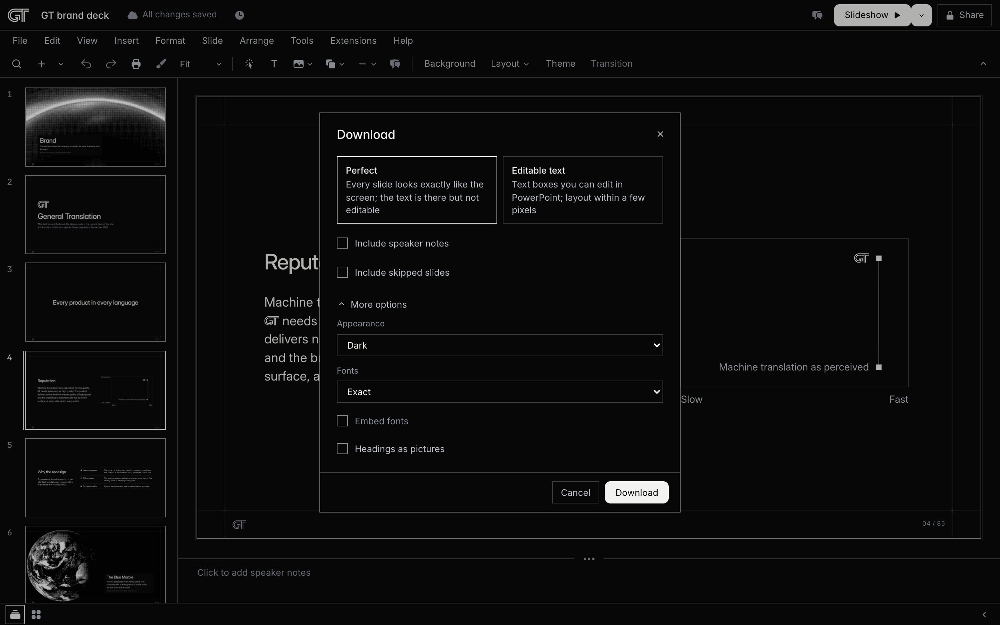

_File > Download > Microsoft PowerPoint opens the Download dialog with Perfect selected._

### 🎤 Present

- ▶️ The Slideshow button (Cmd+Enter) starts the show from the current slide in full screen when the browser allows; its arrow offers Presenter view and Start from beginning (Cmd+Shift+Enter). A click on the slide advances.
- 🧑‍🏫 Presenter view opens `/present/:deckId` in a second window: a timer with Pause and Reset, the clock, the connection status, the current slide with Previous and Next and a slide list, the previous and next slide previews, and the speaker notes with plus and minus text size buttons from 14 to 28 px. The two windows sync over a broadcast channel with a storage fallback, and an arrow key in either window moves both.
- 🎛️ The present toolbar appears at the bottom left when the pointer moves there: Previous, the counter ("6 of 85") as a button that opens the slide list, Next, the laser pointer, full screen, Exit and an Options menu with Open speaker notes, Print and Keyboard shortcuts.
- ⌨️ The keys are Google's presenting table: Right, Space, Enter and Page down advance; Left, Page up and Backspace go back; Home and End; a number then Enter; S opens Presenter view; L toggles the laser pointer; B or . shows a black slide and W or , a white one; Cmd+Shift+F or F11 toggles full screen; Esc leaves.
- 🔦 The laser pointer is a 12 px ink dot with a paper ring that follows the pointer over the sheet.
- 🙈 Skipped slides never appear and the counter counts the shown slides; the show keeps working after load without the network because the deck is in memory.
- 🔗 `/deck/:deckId?present=1` opens the viewer in present mode on load and is the shareable present link; `/deck/gt-brand?present=1` is the GT brand deck as a presentation on any studio that holds it.
- 🤖 `view.present` and `view.goto` are actions, so an agent starts a show and moves it (`deck_goto_slide` over MCP drives the audience window through the attached page).

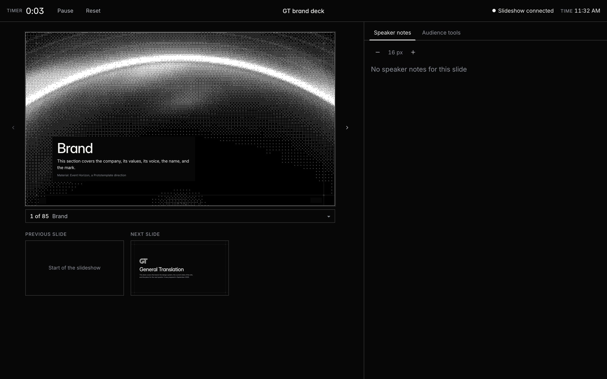

_Presenter view at `/present/gt-brand` with a slideshow window connected in the same browser._

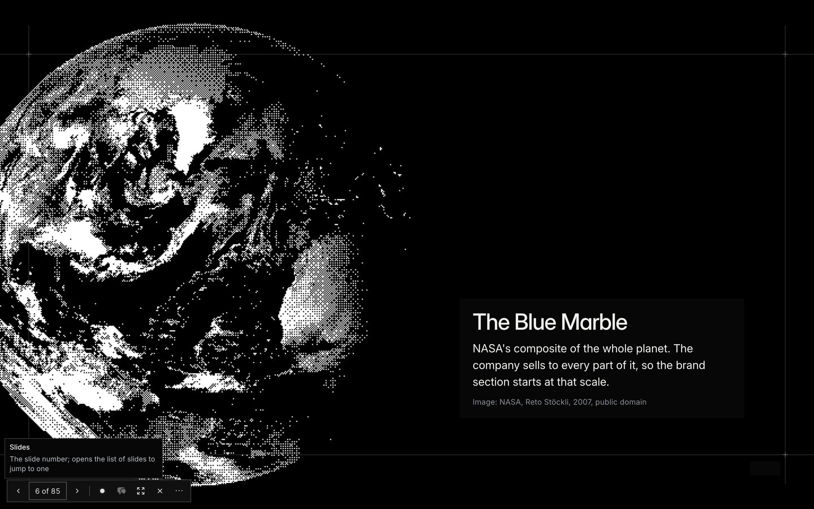

_The slideshow surface: the sheet alone on an ink surround, with the present toolbar on hover._

### 📖 The viewer and sharing

- 📖 `/deck/:deckId` is the reading surface with three modes: Slide, Grid (numbered tiles per section) and Book (the deck as pages with a section index and a slide list with a filter), plus the theme toggle, full screen, Copy link and Help, the shell keys, digits then Enter, and hash deep links (`#12`, `#s/<slideId>`).
- 🧩 `/embed/:deckId` is the framed embed with the `gt-theme` message protocol, the entry point of the Prototemplate site's deck iframe.
- 🔗 Share opens a dialog with three links, each with a Copy button: the View link (`/deck/<id>`), the Present link (`/deck/<id>?present=1`) and the Edit link (`/edit/<id>`). Turboslide has no accounts; anyone who has a link can open it, and the view and present links carry neither skipped slides nor speaker notes.
- 🌍 Publish to web (File > Share > Publish to web, Extensions > Embed in a site) has a Link tab and an Embed tab with the iframe snippet at Small, Medium, Large or a custom size.
- 🔒 A deck in the trash answers 404 on the viewer and the embed.

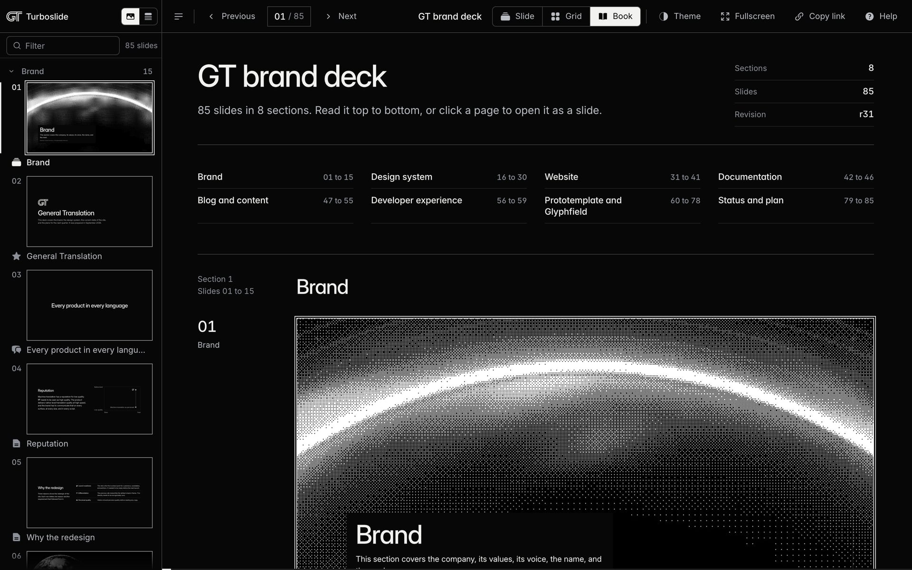

_Book view at `/deck/gt-brand?mode=book`._

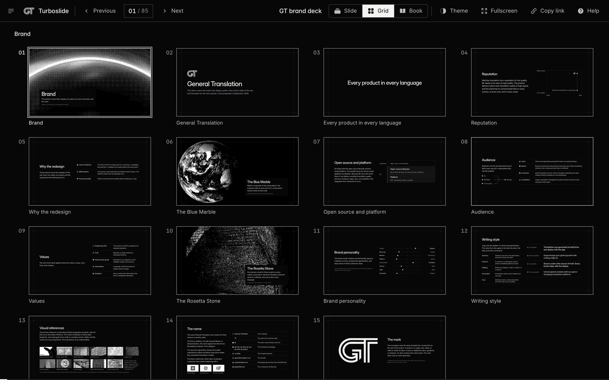

_Grid view at `/deck/gt-brand?mode=grid`._

### 📁 Home and files

- 🏠 `/decks` is the home page: a search field over the titles, "Start a new presentation" with Blank presentation, the GT brand deck template and a Template gallery link, and "Recent presentations" as cards with rendered thumbnails or as a list, sorted by Last opened by me, Last modified or Title. Each card's menu offers Open, Open in new tab, Present, Rename, Make a copy, Download and Move to trash.
- 🗑️ Move to trash (File > Move to trash or the card menu) shows "Moved to trash · Undo"; `/decks/trash` lists the trashed decks with Restore, Delete forever (asked once) and Empty trash. Nothing deletes a deck on its own.
- ✏️ Rename in the title row, from File > Rename or in place on the home card; the first committed heading of an Untitled presentation becomes its title once.
- 📑 Make a copy copies the entire presentation or the selected slides, with or without the speaker notes, and opens the copy in a new tab.
- 📥 Import slides picks a presentation on this studio, then its slides with thumbnails, and inserts the copies with their assets after the current slide in one write. File > Open lists the studio's presentations with a search field and an Upload tab that takes a Turboslide bundle.
- 🕓 Version history (File > Version history, Cmd+Option+Shift+H) lists the versions grouped by day with Only show named versions, Restore this version, Name this version and Make a copy at a version; Name current version saves a named version. Every write is a version record and a restore is itself an undoable write.
- ℹ️ Details shows the title, the slide and section counts, the creation time and the last edit.
- ⏭️ Skip slide keeps a slide out of the show, the shared links and the downloads until it is unskipped.
- 📦 Deck bundles: one zip with `manifest.json` (a digest per file), `deck.json`, the slides, the assets and the version log. Download bundle on a card or in File > Download, upload through File > Open, and `turboslide deck pack`, `unpack`, `push` and `pull` on the CLI move a deck between a checkout and a hosted studio.
- 🤝 Leases and conflicts: the editor takes a ten minute lease on the slide it edits; an agent's write to a held slide is refused with the holder unless forced; a stale revision returns the current document; the editor shows a conflict card with Rebase, Discard or Force and adopts external writes in place.

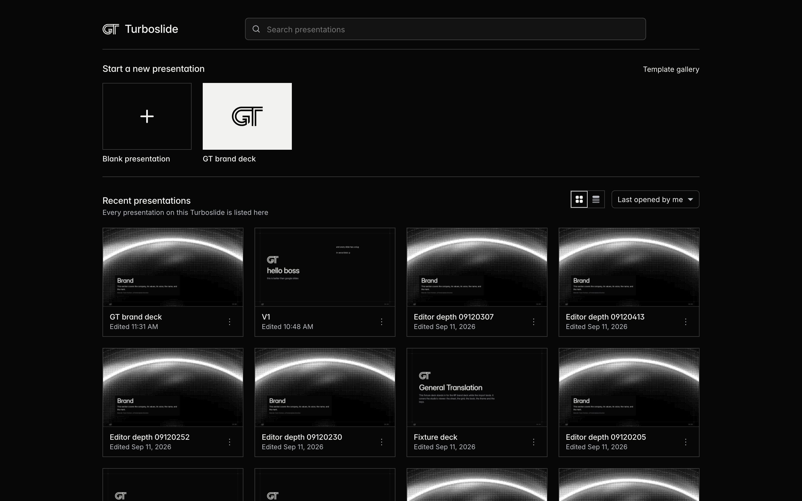

_The home page at `/decks` with the card view and the sort menu._

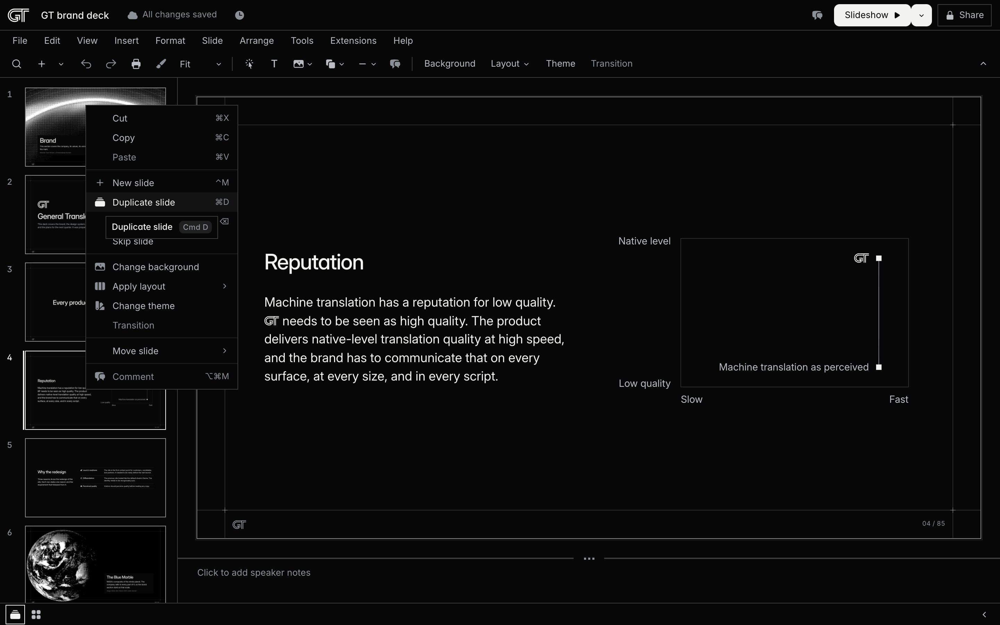

_The filmstrip menu with Google's rows; Duplicate slide is hovered with its Cmd+D tooltip._

### 🤖 Agent native

Every capability of the editor is an action, and every action runs on the transports that fit it: the CLI, MCP, HTTP and the in-page window API share one implementation over one store.

- 🗃️ The action table (`packages/schema/src/actions.ts`, 105 actions with typed Zod inputs and outputs) generates the CLI parsers, the MCP tool list, the window API's action list, the OpenAPI 3.1 document, the manifest, `llms.txt` and the four skills' reference tables with `pnpm generate:contracts`; a stale committed copy fails the check.
- 💻 The `turboslide` CLI edits a local decks folder with no browser page: `info`, `slides`, `slide get|put|patch|insert|remove|move|new|duplicate|skip|apply-layout|import|to-canvas|measure|background`, `block set|insert|remove|move|align|distribute|order|duplicate|group|ungroup|regroup|rotate|flip|crop|mask|reset-image|adjust|alt|shadow|autofit`, `text style|case|insert|list|spacing|columns|indent|replace`, `table merge|unmerge|insert-rows|insert-columns|delete-rows|delete-columns|distribute|cell-style`, `chart set-data|set-kind`, `shape set`, `line set`, `diagram insert`, `deck guides`, `deck background` and the rest of the table below. Every write names the revision it read (`--base-revision`) and its author (`--author agent:<runId>`), and `--json` gives machine output.
- 🔌 MCP over stdio (`turboslide mcp --deck <dir>`) and over streamable HTTP (`/mcp?deck=<id>` on the studio): one `deck_*` tool per action (89 in the generated list; `tools/list` is the honest capability check), the resources `deck://<id>/manifest`, `deck://<id>/slides/<slideId>`, `deck://lint/<id>`, `deck://render/<slideId>/<theme>`, `deck://sheet/<theme>`, `deck://grammar`, `deck://catalog/blocks`, `deck://catalog/icons` and `deck://theme`, and the `deck_review` prompt with the six judge lenses. Render tools return PNGs as image content.
- 🌐 HTTP: `POST /api/actions/<id>?deck=<id>` runs one action with one JSON object and `GET` returns its contract; `GET /api/agent` is the manifest with the execution rules, what this instance implements and the attached pages; `/openapi.json`, `/llms.txt` and `/llms-full.txt` serve the generated files. One error body carries the name, status, code, pointer, current revision and lease holder; an unknown field is a 400 with a pointer to it.
- 🪟 The window API `window.turboslide.studio` in the editor, the viewer, the source drawer and the presenter: `describe()`, `controls()`, `activate(label)`, `set(label, value)`, `readSource()`, `applySource(doc)`, `invoke(action, input)` and `download(artifact)`, addressed by accessible label or `data-control` id. An open `/edit` or `/deck` page attaches itself to the studio's session registry, so `deck_goto_slide` over MCP runs inside that page.
- 📚 Four skills with generated reference tables: [turboslide-api](skills/turboslide-api/SKILL.md) (discovery and the write protocol), [turboslide-create](skills/turboslide-create/SKILL.md) (writing slides in the grammar), [turboslide-studio](skills/turboslide-studio/SKILL.md) (driving the live page) and [turboslide-verify](skills/turboslide-verify/SKILL.md) (evidence, judging and completion rules).
- 🔁 `turboslide deck push <id> --to https://turboslide.vercel.app` uploads a local deck's bundle to the hosted studio and prints its editor URL; `deck pull` brings a hosted deck into the checkout. The bearer token is saved per host in `~/.config/turboslide/hosts.json` after the first `--token` and never printed.
- 🎯 Extensions > Agent access shows the MCP address, the API address and the push and pull commands for this deployment, each with a Copy button.
- 🔒 Every mutating action takes `baseRevision` and rejects a stale one with 409 and the current document; writes return the normalized slide and its findings; leases are enforced for agent authors; external writes reach an open editor within a second.
- 🧑‍⚖️ The judge loop: `turboslide judge bundle` packages renders in both themes, contact sheets with cell maps, the lint findings with the gate, the document, the outline and the numerals per slide; `scripts/judge-loop.mjs` runs six judges by lens (layout, visual consistency, copy, accuracy, completeness, art direction), skeptics and fixers under leases through the Claude Agent SDK or the `claude` CLI, and writes `gate.json` with a verdict at a named revision.
- 🧹 The grammar linter: 55 rules in a static layer over the document and a rendered layer over render records (overflow, the 15 px floor, the weight cap, palette colours, icon placement, copy rules, plate clearance, contrast in both themes, line law, the canvas rules), with `turboslide fix` applying the mechanical ones; Tools > Check slides shows the same findings in prose with Fix, and `lint --chrome` audits the editor's own lines at three widths.
- 🧾 The source drawer (Tools > Advanced > Show source) shows the selected slide's JSON with schema completion, Apply through the validator, Copy as turboslide command, and registers as a window API owner so `applySource` and Apply are one path.

### ✅ Quality gates

- ✅ `pnpm check` runs 25 steps in order and stops at the first failure: the frozen install, route generation, the contracts diff, `tsc -b`, vitest, the build with the client bundle check, the re-import of the GT deck at zero escape blocks, validation, 170 renders with no page errors, the compare against the Prototemplate deck's own screenshots within 0.5 percent, the contact sheets, lint, the standalone build under 16 MB, the viewer Playwright spec, the chrome line law at 1440, 1280 and 390 in both themes on four pages, the format check, the Google parity audit, the parity Playwright specs, the fixture deck exported in both modes with the flatten report perfect, the fonts build check, the canvas fidelity gate and the container verification.
- 🔬 The parity audit (`scripts/gslides-parity-audit.mjs`) walks the built studio and checks over 2,100 rows: every menu item's presence, label, key, enabled state and tooltip against the menu model, the toolbar tails, the context menus, the dialogs and the canvas facts.
- 📸 `scripts/compare-to-shoot.mjs` diffs every render of the GT deck against the brand deck's original `shoot-slide.mjs` screenshots on the same Chrome for Testing build.
- 🧪 The fixture decks: `decks/fixture` for the tests and `decks/fixture/gslides` (27 slides) exercising every canvas field, exported in both modes on every run with the Perfect report at 0.000 percent decoded mismatch.
- 🐳 The container verification builds the render worker image (Chrome for Testing, LibreOffice and the fonts) and runs the Editable text export of the fixture deck with `--verify` inside it.
- 📐 `scripts/canvas-fidelity.mjs` converts every slide of the GT deck and the templates to the canvas and compares the two renders per theme (342 pairs, worst 0.262 percent).
- 💬 `scripts/tooltip-audit.mjs` fails on any control without a tooltip; the default view words test fails on any engineering word in a label, tooltip or finding.
- 🧾 Playwright specs cover the ten sales tasks, text editing, the filmstrip, the home page, present mode, the parity actions on every transport, deck transfer, the canvas, objects, text styles, tables, charts, hygiene and the batched export; the local agent walk runs every canvas action on the CLI and over MCP.
- 🦀 `cargo test` covers the Rust crate with byte parity against Pillow fixtures, and the effects parity test proves the TypeScript, napi and wasm screens light the same cells.
- 🩺 `scripts/hosted-smoke.mjs <url>` probes a deployment (the redirect, the fresh presentation, the viewer, the editor, the home page, the trash, the print preview, the presenter, an asset, the bearer rule, the snapshot count and, with the token, a batched export).

### 🚀 Hosting

- ☁️ The studio runs on Vercel at [https://turboslide.vercel.app](https://turboslide.vercel.app) from `apps/studio` through Nitro's Vercel preset; production deploys come from the push to `main`.
- 🗄️ One store selection per process: `file` in a checkout (`decks/` in git), `tmp` inside a function without a Blob token (edits live for the instance and the editor says so), `blob` with `BLOB_READ_WRITE_TOKEN` (the Vercel Blob store `turboslide-decks`, with `deck.json` committed under `ifMatch` and an immutable snapshot per revision). The function carries the GT deck and the templates as its seed.
- 🧭 Renders and exports run inside the function on `chrome-headless-shell`, every export synchronous. A Download of a deck longer than 60 slides runs as batches with a progress sentence and a final merge; the 85 slide GT deck exports from production in about four minutes with a peak of about 670 MiB against the 3009 MB function.
- 🔐 `TURBOSLIDE_TOKEN` is set on production and preview: the agent routes open to callers that send `Authorization: Bearer <token>`, the raw export, render and bundle routes require it, and the editor reaches them through server functions and short-lived tickets so the page never holds the token. Without a token an instance serves the agent surface to localhost only.
- 🐳 In a checkout, renders and exports run on the render worker (`apps/render-worker`), started by the studio in dev or as the Docker image `turboslide-render-worker` over `TURBOSLIDE_WORKER_URL`; the image carries Chrome for Testing, LibreOffice and the fonts and is where `--verify` runs.
- 🧾 [docs/hosting.md](docs/hosting.md), [docs/hosting-chromium.md](docs/hosting-chromium.md) and [docs/HOSTED-STATUS.md](docs/HOSTED-STATUS.md) record the store, the browser, the deploy configuration and the measured numbers.

## Getting started

Turboslide needs Node 24 and pnpm 11.15.1, which corepack installs from the `packageManager` field. Renders, exports and the tests need the Chrome for Testing binary that `playwright-core` installs.

```sh
git clone https://github.com/Kevin-Liu-01/Turboslide.git
cd Turboslide
corepack enable
pnpm install
pnpm exec playwright-core install --with-deps chromium
pnpm dev
```

`pnpm dev` starts the studio on [http://localhost:4321](http://localhost:4321), always on that port. The root opens a fresh presentation; `/decks` lists the decks under `decks/`, where the GT brand deck and the templates live; `/edit/gt-brand` opens the brand deck. Derived files land under `.turboslide/`, which is not committed.

```sh
pnpm generate-routes     # write apps/studio/src/routeTree.gen.ts (before typecheck)
pnpm generate:contracts  # regenerate the CLI, MCP, OpenAPI, manifest, llms and skill tables from the action table
pnpm typecheck           # tsc -b over every package
pnpm test                # vitest, every package as a project
pnpm lint                # eslint per package with the baseline
pnpm build               # the studio bundle and the CLI bundle
pnpm check               # the 25 step acceptance chain; node scripts/check.mjs --list prints the steps
```

The CLI runs from the repository root as `pnpm exec turboslide <command>` and finds the deck from a `deck.json` upward or from `--deck <dir>`. An agent uses it the same way:

```sh
pnpm exec turboslide info --json
pnpm exec turboslide slides --json
pnpm exec turboslide slide new --layout split --after title --deck decks/gt-brand
pnpm exec turboslide render all --theme light,dark --out .turboslide/render --json
pnpm exec turboslide lint all --json
pnpm exec turboslide export pptx --mode flatten --theme both --out .turboslide/export
pnpm exec turboslide mcp --deck decks/gt-brand
```

Optional tooling: Docker for the render worker image and the container verification, Python 3 with fontTools in `.turboslide/venv` for `turboslide fonts build`, Rust with the `wasm32-unknown-unknown` target and `wasm-bindgen-cli` for the native module ([docs/native.md](docs/native.md)), and the Prototemplate checkout for the two check steps that re-import the brand deck and compare against its screenshots.

## The CLI in brief

Every command is an action of the table; `--json` prints machine output, `--base-revision` names the revision a write read, `--author` names the writer, and exit codes are 0, 1 (findings at the gate or a verify failure) and 2 (usage or validation).

| Group                | Commands                                                                                                                                                                                                                                                                 |
| -------------------- | ------------------------------------------------------------------------------------------------------------------------------------------------------------------------------------------------------------------------------------------------------------------------ |
| Deck                 | `info`, `validate`, `import <dir> --into <id>`, `deck create <name> --from gt-brand\|blank`, `deck rename`, `deck set <path> <value>`, `deck list`, `deck copy`, `deck trash`, `deck restore`, `deck remove --confirm`, `deck background`, `deck guides`, `sections set` |
| Bundles and transfer | `deck pack <id>`, `deck unpack <file.zip>`, `deck push <id> --to <url>`, `deck pull <id> --from <url>`                                                                                                                                                                   |
| Slides               | `slides`, `slide get\|put\|patch\|insert\|remove\|move`, `slide new --layout`, `slide duplicate`, `slide skip`, `slide apply-layout`, `slide import`, `slide set-layout`, `slide to-canvas`, `slide measure`, `slide background`                                         |
| Blocks and objects   | `block set\|insert\|remove\|move`, `block align\|distribute\|order\|duplicate`, `block group\|ungroup\|regroup`, `block rotate\|flip`, `block crop\|mask\|reset-image\|adjust`, `block alt`, `block shadow`, `block autofit`                                             |
| Text                 | `text style`, `text case`, `text insert`, `text list`, `text spacing`, `text columns`, `text indent`, `text replace`                                                                                                                                                     |
| Tables and charts    | `table merge\|unmerge\|insert-rows\|insert-columns\|delete-rows\|delete-columns\|distribute\|cell-style`, `chart set-data`, `chart set-kind`                                                                                                                             |
| Shapes and lines     | `shape set`, `line set` (kinds, decorations, weight, dash, bend, points, `--connect-start`, `--connect-end`, `--detach`), `diagram insert --kind --count --style`                                                                                                        |
| Assets and materials | `asset add <file\|url> --role --alt [--two-tone]`, `asset dither`, `asset capture <url>`, `material list`, `material capture <id> --anchor <ms>`                                                                                                                         |
| Render and verify    | `render [ids\|all] --theme light,dark --scale 1\|2`, `sheet --cols --thumb --overlay lint\|plate`, `lint [--layers static\|rendered\|both] [--baseline]`, `lint --chrome --url --widths --themes`, `fix [--rule]`, `judge bundle --out`, `diff [from [to]] [--render]`   |
| Versions and leases  | `version save\|list\|restore`, `lease <slideId> [--force] [--release]`                                                                                                                                                                                                   |
| Export               | `export pptx --mode flatten\|native --theme light,dark\|both [--embed-fonts] [--include-notes] [--include-skipped] [--verify]`, `export pdf`, `export txt`, `export jpeg`, `export check <file.pptx>`, `build --out <file> --budget 16`, `fonts build [--check]`         |
| Agent surface        | `mcp` (the MCP server over stdio), `generate` (the contracts generator)                                                                                                                                                                                                  |

The generated reference with every action's input, transports, CLI usage and MCP tool is [skills/turboslide-api/references/actions.md](skills/turboslide-api/references/actions.md).

## Architecture

The repository is a pnpm workspace on TanStack Start, TypeScript strict and ESM throughout, with no barrel files: every package exports its modules through explicit subpaths. Every package under `packages/` except `viewer`, `chrome` and `native` is framework free, and headless Chromium never runs inside the web app in a checkout.

**apps/studio** is the TanStack Start application deployed to Vercel: the editor at `/edit/:deckId` and the draft at `/new`, the home page and the trash, the viewer, the embed, the presenter and the print preview, the agent HTTP surface, MCP over HTTP, the export downloads, the bundle routes and the server functions the pages reach the store through.

**apps/cli** is the `turboslide` binary, the file transport that needs no browser page. Its `store-actions.ts` registers every write as a typed function on the dispatcher, and the studio's HTTP and MCP routes and the editor's own handlers run those same store actions, so one implementation serves the four transports.

**apps/render-worker** is the job queue the studio's renders and exports run on in a checkout (render, sheet, export, verify, PDF and measure jobs over the CLI), with an HTTP surface and a render cache; the Docker image `turboslide-render-worker` carries Chrome for Testing, LibreOffice and the fonts, and inside a Vercel function the worker runs in process.

**packages/schema** holds the document: the types and Zod schemas, `validateDeck`, `applyWrite`, `diffDecks`, the migrations, the block catalogue, the rule table, the 21 layouts and `applyLayout`, the canvas conversion (`toCanvas`, `fromCanvas`), the 135 shape presets with the ECMA geometry interpreter, the connectors, the diagram templates, the text markup and the action table.

**packages/store** is the deck store behind one `DeckStore` type: `FileStore` over `decks/`, the tmp overlay and the Vercel Blob mirror; typed writes, the version log, leases, the watch channel, the templates, the seed, the store selection and the deck bundle (zip, pack, unpack).

**packages/render** is the renderer: `renderSlide`, `renderDeck`, `renderStandalone`, `renderThumb`, `renderStage`, the print document, the block renderers, the diagram and chart SVG on the half-pixel grid, and the one DOM measurer the canvas conversion reads.

**packages/theme** is `gt-ink-paper`: `sheet.css` and `stage.css` ported once from the brand deck's `head.html`, the same values as data in `tokens.ts` with a parity test, and the icon sprite. **packages/fonts** carries InterVariable and its italic, and the static export font set cut by `scripts/build-fonts.py`.

**packages/viewer** is the React viewer and editor stage: Stage, Sheet, the slide, grid and book modes, the Editor with selection, gestures, the canvas handles, marquee, snap lines, rulers, guides, crop mode, zoom and pan, the present pieces (the toolbar, the slide list, the presenter console, the channel) and the material mount.

**packages/chrome** is the Prototemplate shell ported as source (`PORTED_FROM.json` records the origin of every file): the tokens, the title row, the menu bar and its model, the toolbar and its tails, the filmstrip, the panels, the dialogs, the pickers, the context menus, the snackbar, the tooltip primitive and the editor shell contract.

**packages/export** is the exporter: scene extraction in headless Chromium, PPTX in the perfect and editable text modes through pptxgenjs, the page raster policy, the OOXML post-process and package validation, the PDF printer, the verify loop over LibreOffice, the batched export plan and merge, and `export check`.

**packages/headless** drives Chrome for Testing through Playwright: launch, readiness, the sheet page, measurement, screenshots, the PDF, the site capture recipes and the shell driver the chrome lint uses.

**packages/effects** is the two-tone pipeline (Bayer dither, tone, resample, filters), the 1-bit PNG encoder, plate metrics, the diffs and DSSIM, and the backend selection between the native addon, the wasm module and TypeScript. **packages/native** and **crates/turboslide-native** are the Rust crate behind `@turboslide/native` with its napi and wasm bindings and the per platform packages.

**packages/materials** is the Paper Shaders catalogue with uniform schemas and presets, the stage mount, `material.capture` and the asset actions. **packages/lint** is the grammar linter with its static and rendered rules, the fixture deck and the known findings gate. **packages/import** turns the Prototemplate deck HTML into the document with zero escape blocks.

**packages/agent** is the action dispatcher, the HTTP request rules, the window API and the contracts generator with its committed outputs (manifest, describe, CLI, MCP tools, OpenAPI, `llms.txt`). **packages/mcp** is the MCP server over stdio and streamable HTTP.

**decks/** holds `gt-brand` (the GT brand deck), `templates/gt-brand` and `templates/blank` (what `deck.create` copies) and `fixture` (the test decks). **skills/** holds the four agent skills, **scripts/** the acceptance chain and the audits, **docker/** the render worker image, **tooling/** the shared tsconfig, eslint and prettier configs, and **docs/** the reference and status documents.

## Documentation

| Document                                                                                                                                                                                                  | What it covers                                                                                                        |
| --------------------------------------------------------------------------------------------------------------------------------------------------------------------------------------------------------- | --------------------------------------------------------------------------------------------------------------------- |
| [docs/README.md](docs/README.md)                                                                                                                                                                          | The index of the documents, who wrote each and when                                                                   |
| [AGENTS.md](AGENTS.md)                                                                                                                                                                                    | The rules for working in the repository: code rules, the agent surface, the parity chains, acceptance, the deviations |
| [docs/spec/SPEC.md](docs/spec/SPEC.md)                                                                                                                                                                    | The specification: the document model, the renderer, the editor, the agent surface, export, hosting                   |
| [docs/gslides-parity/SPEC.md](docs/gslides-parity/SPEC.md)                                                                                                                                                | The Google Slides parity specification: the shell, the menus, the toolbar, the layouts, home and files, present, keys |
| [docs/gslides-parity/SPEC-2.md](docs/gslides-parity/SPEC-2.md)                                                                                                                                            | Round two: the canvas, the field table, the 36 canvas actions, Format options, the canvas behaviours, hosted export   |
| [docs/gslides-parity/VERIFICATION-2.md](docs/gslides-parity/VERIFICATION-2.md)                                                                                                                            | The verifier's record of round two, the parity audit, the canvas walk, the exports, production                        |
| [docs/grammar.md](docs/grammar.md)                                                                                                                                                                        | The generated grammar: the sheet, the text markup, the slide kinds, the layouts, every block type, the lint rules     |
| [docs/freeform.md](docs/freeform.md)                                                                                                                                                                      | Freeform slides, positions, palette colours, typography, the primitives, snapping, the canvas conversion              |
| [docs/pptx.md](docs/pptx.md)                                                                                                                                                                              | PPTX export: what perfect means, the raster policy, the editable text mode, the post-process, verification, the PDF   |
| [docs/export-verification.md](docs/export-verification.md)                                                                                                                                                | The verify loop, the render worker image, the calibration deck and the manual PowerPoint checklist                    |
| [docs/deck-transfer.md](docs/deck-transfer.md)                                                                                                                                                            | The deck bundle, pack, unpack, push and pull, the bundle routes and the hosted limits                                 |
| [docs/hosting.md](docs/hosting.md)                                                                                                                                                                        | The store selection, the seed, the Blob backend, the deploy configuration, the bearer token, verifying a deployment   |
| [docs/hosting-chromium.md](docs/hosting-chromium.md)                                                                                                                                                      | Renders and exports inside the Vercel function                                                                        |
| [docs/judge-loop.md](docs/judge-loop.md)                                                                                                                                                                  | The evidence bundle, the judges, the skeptics, the fixers and the gate                                                |
| [docs/native.md](docs/native.md)                                                                                                                                                                          | The Rust crate, the napi and wasm bindings, the backend selection and the parity results                              |
| [docs/M1-STATUS.md](docs/M1-STATUS.md), [M2](docs/M2-STATUS.md), [M3](docs/M3-STATUS.md), [M4 and M5](docs/M4-M5-STATUS.md), [Hosted](docs/HOSTED-STATUS.md), [Editor depth](docs/EDITOR-DEPTH-STATUS.md) | The measured state of each round with its acceptance numbers                                                          |
| [skills/](skills/)                                                                                                                                                                                        | The four agent skills: turboslide-api, turboslide-create, turboslide-studio, turboslide-verify                        |
| [THIRD_PARTY_NOTICES.md](THIRD_PARTY_NOTICES.md)                                                                                                                                                          | Third-party licenses                                                                                                  |

## License

MIT, copyright 2026 Kevin Liu ([LICENSE](LICENSE)). Third-party licenses are listed in [THIRD_PARTY_NOTICES.md](THIRD_PARTY_NOTICES.md).
