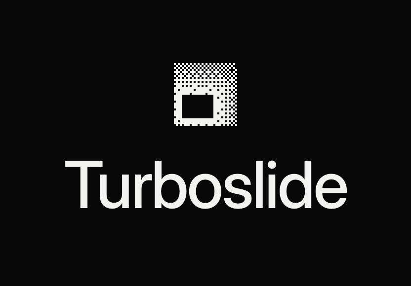
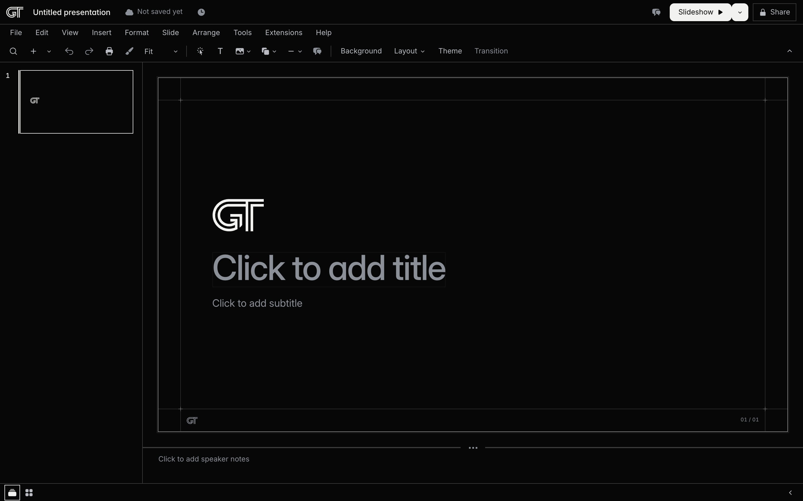

# Turboslide

<picture>
  <source srcset="docs/readme/brand/lockup-stacked-light.png" media="(prefers-color-scheme: dark)" width="416">
  
</picture>

Turboslide is an agent native slides editor with Google Slides' behaviours, a canvas on every slide and a pixel identical PowerPoint export. It keeps Google Slides' structure in the Prototemplate look. A deck is a block document: a manifest plus one JSON file per slide plus assets with light and dark twins, validated by one schema and checked by a grammar linter. One framework free renderer turns that document into the same HTML and CSS everywhere, so the browser editor, the static viewer, the embed, the CLI's screenshots and the exporters draw from one source and a render at revision N is the same pixels on every surface. Every slide is a canvas: an object drags, resizes, rotates and reorders as it does in Google Slides, and the GT brand layouts are the templates a canvas re-flows by. Every operation is a named action in one table, from which the CLI, the MCP server, the HTTP API, the in-page window API, the OpenAPI document and the agent skills are generated, so a person's click and an agent's call take the same path through the same validator. Export is perfect PPTX: each page is the rendered slide over a searchable text layer, measured against the web render before the file is written, with an editable text mode beside it. The studio is hosted at [https://turboslide.vercel.app](https://turboslide.vercel.app), a Vercel project on Kevin's personal team with one public Blob store, on fluid compute; the sync and costs round of 2026-09-21 ([docs/SYNC.md](docs/SYNC.md)) defined and proved the order of the write path (one ordered log per deck, the server transform before placement on every tier, a record that names its origin so a resent write is admitted once) and put every page state's requests and store calls under a counted ceiling, and [docs/HOSTING-MOVE.md](docs/HOSTING-MOVE.md) is the plan to move the deployment to the General Translation team's Vercel account and leave this address as a redirect that costs nothing; the move has not run yet.

Since the focus round of 2026-09-15 the editor's default view holds the features a seller uses weekly, and a feature is in the default view only when every one of its interactions passes a driven run against production. Everything else stays in the product behind Tools > Advanced tools. [docs/FOCUS.md](docs/FOCUS.md) is the specification of that rule, the core set, the parked set and the test matrix.



_The root of the hosted studio redirects to `/new`, a fresh presentation that is created in the store on its first edit._

- Live studio: [https://turboslide.vercel.app](https://turboslide.vercel.app), with the product page at [/home](https://turboslide.vercel.app/home) and the agent guide at [/llms.txt](https://turboslide.vercel.app/llms.txt)
- What is in the default view and why: [docs/FOCUS.md](docs/FOCUS.md); the release notes: [docs/updates.md](docs/updates.md)
- Documentation: [docs/README.md](docs/README.md) and the index at the end of this page
- The identity: [docs/brand.md](docs/brand.md); why it is fast: [docs/performance.md](docs/performance.md)
- Rules for working in the repository: [AGENTS.md](AGENTS.md)
- License: MIT ([LICENSE](LICENSE))

## Contents

- [What works today](#what-works-today)
- [Advanced tools](#advanced-tools)
- [The identity](#the-identity)
- [Why it is fast](#why-it-is-fast)
- [Getting started](#getting-started)
- [The CLI in brief](#the-cli-in-brief)
- [Architecture](#architecture)
- [Documentation](#documentation)
- [License](#license)

<!-- what-works:begin -->

## What works today

Turboslide is a slide editor for a team that tailors an existing deck and presents it. Every feature in the default view is driven end to end against the production deployment before a release, at human speed, and the release note carries the table of what passed. Features that are not yet tested that way are behind Tools > Advanced tools and are documented as advanced.

_Rendered from `docs/gslides-parity/focus/core-matrix.json` by `docs/readme/what-works.mjs`, from what the focus audits saw on production on 2026-09-15. A feature appears below only while every row of its part of the matrix passes; the rest of the matrix is listed under "Held until every row passes". [docs/FOCUS.md](docs/FOCUS.md) is the specification._

**Costs.** An open editor, a hidden tab, an editing session, two tabs on one deck and a show each make a bounded number of requests a minute, and the store calls a deck costs a minute are counted in every release run and stay under their ceilings.

Walked by hand, never counted as passed by a run (docs/gslides-parity/focus/manual-checklist.md): `text.clipboard.paste-without-formatting`.

Measured and recorded, never holding a release (docs/PRODUCT.md 8.2): `export.download.large-deck-pdf` (broken), `export.download.large-deck-pptx` (broken), `cost.editor-idle.calls` (broken), `cost.editor-hidden.calls` (broken), `cost.editor-editing.calls` (broken), `cost.show.calls` (broken).

### Held until every row passes

A feature is in the default view only when every one of its interactions passes on the preview and on production (docs/FOCUS.md section 1). Each feature below has a row that failed or was not driven in the run above, so its menu rows sit behind Tools > Advanced tools until the rows named pass; the switch itself cannot be parked, and a failed or not driven row of it blocks the release.

- Decks: 25 of 64 rows hold it: `decks.new.ground-paint` (flaky), `decks.title.tab-title-after-rename` (broken), `decks.save.acknowledged` (flaky), `decks.card.rename-enter` (broken), `decks.row.rename-enter` (broken), `decks.card.make-a-copy` (flaky), `decks.card.open-in-new-tab` (flaky), `decks.trash.listed-after-move` (flaky), `decks.trash.lists-after-restore` (broken), `decks.trash.delete-forever-enter` (broken), `decks.access.paint` (flaky), `decks.file.make-a-copy` (not driven), `decks.name.follows-heading` (broken), `decks.recent.drops-trashed` (broken), `decks.trash.editor-undo-snackbar` (broken), `decks.recent.this-browser-sentence` (not driven), `decks.home.seller-lead` (broken), `decks.card.thumbnail-slide-1` (broken), `decks.card.edited-relative-time` (broken), `decks.card.more-glyph` (broken), `decks.trash.button-heights` (broken), `decks.trash.confirm-dialog-chrome` (broken), `decks.new.skeleton-one-frame` (broken), `decks.access.stranger-links` (broken), `decks.notfound.sentence-case` (broken).
- Slides: 18 of 85 rows hold it: `slides.delete.two-selected-menu` (broken), `slides.delete.two-selected-edit-menu` (broken), `slides.delete.canvas-focus-undo` (flaky), `slides.delete.undo-redo-saved` (flaky), `slides.layout.fresh-slide-two-picks-no-carry` (broken), `slides.layout.snackbar-counts-typed-only` (broken), `slides.clipboard.copy-paste-card` (not driven), `slides.reorder.menu-up-down-beginning` (not driven), `slides.reorder.cmd-shift-up-down` (not driven), `slides.notes.view-menu-toggle` (not driven), `slides.context.empty-canvas` (not driven), `slides.numbers.apply` (not driven), `slides.layout.title-and-body-single` (broken), `slides.layout.subtitle-prompt` (not driven), `slides.layout.new-slide-inherits` (not driven), `slides.layout.tile-sentences` (broken), `slides.layout.plate-four-columns` (broken), `slides.import.none-preselected` (broken).
- Text: 46 of 91 rows hold it: `text.title.single-click` (broken), `text.selected.typing-replaces` (not driven), `text.selected.enter-appends` (not driven), `text.title.double-click-enters` (not driven), `text.textbox.drag-inside-moves` (broken), `text.textbox.burst-reliability` (broken), `text.italic.toolbar-word` (broken), `text.color.swatch-on-word` (broken), `text.list.bulleted-toolbar` (broken), `text.list.numbered-toolbar` (broken), `text.link.cmd-k-enter` (broken), `text.link.present-click` (not driven), `text.format-menu.text-fitting` (not driven), `text.autofit.textbox-grow` (broken), `text.find-replace.shortcut` (flaky), `text.list.numbered-menu-preset` (not driven), `text.list.chords` (not driven), `text.link.toolbar-button` (not driven), `text.format-options.panel` (not driven), `text.layout-runs.type` (not driven), `text.context.text-block` (not driven), `text.context.text-selection` (not driven), `text.context.inside-session` (broken), `text.format-menu.size-decrease` (not driven), `text.format-menu.spacing-single-1-15` (not driven), `text.format-menu.align-indent-rows` (not driven), `text.textbox.toolbar-button` (not driven), `text.title.one-click-tail` (broken), `text.title.bold-menu` (broken), `text.title.bold-cmd-b` (broken), `text.title.align-menu` (broken), `text.title.size-menu` (broken), `text.title.format-options-marks` (broken), `text.title.apply-layout-after-format` (not driven), `text.fontsize.type-one-undo` (broken), `text.format-options.field-one-undo` (broken), `text.link.detect-url` (broken), `text.link.detect-email` (broken), `text.select.double-click-address` (broken), `text.select.shift-home-line` (broken), `text.link.popover-apply-remove` (broken), `text.link.slide-target` (broken), `text.format-options.padding-grid` (broken), `text.format-options.remembers-section` (not driven), `text.autofit.shrink-on-overflow` (not driven), `text.find-replace.count-while-typing` (broken).
- Pictures: 25 of 53 rows hold it: `images.insert.first-on-new-deck` (broken), `images.insert.upload` (flaky), `images.insert.upload-while-pending` (broken), `images.insert.drop` (flaky), `images.insert.paste` (flaky), `images.guides.centre-x` (flaky), `images.resize.edge-fill` (broken), `images.crop.toolbar-escape-cancels` (broken), `images.replace.upload` (broken), `images.background.upload-picture` (flaky), `images.replace.drop-on-picture` (not driven), `images.context.image` (not driven), `images.options.menu-row` (not driven), `images.background.hex-field` (not driven), `images.insert.centred-in-body` (broken), `images.insert.instant-preview` (broken), `images.caption.add` (not driven), `images.options.picture-sections-only` (broken), `images.insert.menu-direct` (broken), `images.upload.failure-snackbar` (not driven), `images.transparency.slider` (broken), `images.border.drawn` (broken), `images.insert.by-url` (broken), `logos.intake.svg-sentence` (broken), `logos.intake.url-sentence` (broken).
- Selection and arrange: 25 of 80 rows hold it: `arrange.multi.drag-inside-moves-all` (broken), `arrange.align.right` (flaky), `arrange.align.top` (broken), `arrange.align.bottom` (broken), `arrange.clipboard.cut-paste-undo` (flaky), `arrange.clipboard.menu-copy-paste` (flaky), `arrange.clipboard.paste-after-new-slide-button` (broken), `arrange.clipboard.paste-with-filmstrip-focus` (broken), `arrange.duplicate.menu-selects-copy` (broken), `arrange.redo.after-undone-duplicate` (broken), `arrange.keys.backspace-empty-selection` (broken), `arrange.zoom.menu-in` (broken), `arrange.zoom.cmd-minus` (broken), `arrange.zoom.cmd-plus` (broken), `arrange.zoom.fit` (flaky), `arrange.zoom.menu-out` (broken), `arrange.zoom.menu-presets` (not driven), `arrange.toolbar.select` (not driven), `arrange.group.context-rows` (not driven), `arrange.context.rotate-distribute` (not driven), `arrange.guides.drag` (flaky), `arrange.snap.grid-effect` (not driven), `arrange.insert.selected-after-menu` (broken), `arrange.insert.free-rectangle` (not driven), `arrange.group.tail-text-controls` (not driven).
- Shapes: 16 of 24 rows hold it: `shapes.insert.named-rows` (not driven), `shapes.default-look` (broken), `shapes.move` (not driven), `shapes.resize.eight-handles` (not driven), `shapes.rotate` (not driven), `shapes.fill.colour` (not driven), `shapes.border.colour-weight-dash` (not driven), `shapes.text.type-align-bold` (not driven), `shapes.duplicate-delete-undo-redo` (not driven), `shapes.format-options.size-position` (not driven), `shapes.export.pdf` (not driven), `shapes.export.pptx` (not driven), `shapes.reload-and-viewer` (not driven), `shapes.context.shape` (not driven), `shapes.text.colour-toolbar` (broken), `shapes.label.centred-default` (broken).
- Lines: 7 of 11 rows hold it: `lines.insert.line-drag` (not driven), `lines.insert.arrow-drag` (not driven), `lines.end-handle` (not driven), `lines.tail.colour-weight-dash-ends` (not driven), `lines.context.line` (not driven), `lines.connector.re-end` (not driven), `lines.tail.line-start-end-menu` (not driven).
- Present: 5 of 21 rows hold it: `present.keys.blank-black-white` (not driven), `present.skipped-left-out` (not driven), `present.show.no-white-block` (broken), `present.show.bar-on-entry` (broken), `present.presenter.sentence-case` (broken).
- Share: 15 of 25 rows hold it: `share.view-link-cannot-edit` (broken), `share.stranger-cannot-edit` (broken), `collab.edit-from-second-browser` (flaky), `collab.slide-added-appears` (flaky), `collab.presence-chips` (broken), `collab.rename-reaches-second-browser` (broken), `share.view-link-excludes-skipped-and-notes` (not driven), `share.present-link-excludes-skipped` (not driven), `share.file-menu-share-with-others` (not driven), `share.dialog.one-link` (broken), `share.dialog.slideshow-checkbox` (not driven), `share.dialog.more-row` (broken), `share.dialog.you-label` (broken), `share.name-prompt.first-share` (not driven), `share.dialog.co-edit-from-copied-link` (broken).
- Comments: 5 of 8 rows hold it: `comments.on-title-placeholder` (broken), `comments.resolve` (flaky), `comments.toolbar-and-menu-routes` (not driven), `comments.reaches-second-browser` (not driven), `comments.panel.empty-gesture` (broken).
- Version history: 5 of 9 rows hold it: `versions.restore` (flaky), `versions.undo-restore` (not driven), `versions.show-changes-marks` (not driven), `versions.panel.author-you` (broken), `versions.field.square` (broken).
- Download and print: 13 of 33 rows hold it: `export.pdf.notes-honest` (broken), `export.print.download-pdf-follows-preview` (broken), `export.print.file-menu-after-close` (flaky), `export.html.web-page` (flaky), `export.jpg.current-slide` (broken), `export.png.current-slide` (broken), `export.download.named-after-title` (broken), `export.download.pdf-direct` (broken), `export.download.pptx-direct` (broken), `export.download.options-dialog` (not driven), `export.download.progress-per-slide` (broken), `export.download.mode-sentence` (not driven), `logos.export.pdf-pptx-crisp` (not driven).
- Help: 3 of 8 rows hold it: `help.documentation-link` (broken), `help.shortcuts.no-duplicates` (broken), `help.shortcuts.question-key` (broken).
- Tables: 33 of 43 rows hold it: `tables.cell.tab-from-written` (broken), `tables.cell.shift-tab` (not driven), `tables.menu.format-table-with-session` (broken), `tables.menu.format-table-selected` (broken), `tables.menu.format-table-rows` (not driven), `tables.column.insert-keeps-widths` (broken), `tables.column.resize-seam` (not driven), `tables.cell.align-menu` (broken), `tables.cell.align-toolbar` (broken), `tables.cell.fill-border-tail` (not driven), `tables.cells.merge-unmerge` (not driven), `tables.tail.merge-unmerge-buttons` (not driven), `tables.distribute.rows-columns` (not driven), `tables.light-appearance` (not driven), `tables.export.pptx-editable` (broken), `tables.cell.click-places-caret` (broken), `tables.cell.click-then-type` (broken), `tables.range.drag-from-selected` (not driven), `tables.selected.typing-appends` (broken), `tables.cell.arrows-cross-cells` (not driven), `tables.range.shift-arrows` (not driven), `tables.range.bold-italic` (broken), `tables.range.size-color` (not driven), `tables.panel.table-first` (broken), `tables.seam.row-drag` (not driven), `tables.edge.add-row-column` (not driven), `tables.heads.select-row-column` (not driven), `tables.bar.row-column-buttons` (not driven), `tables.paste.tsv-makes-table` (broken), `tables.paste.into-cell-spreads` (broken), `tables.command.keeps-caret` (broken), `tables.cells.prompt-hovered-only` (broken), `tables.cells.tabular-figures` (broken).
- Charts: 18 of 29 rows hold it: `charts.type.panel-legible` (broken), `charts.type.toolbar` (not driven), `charts.type.menu` (not driven), `charts.data.toolbar-edit-data` (not driven), `charts.data.menu-edit-data` (not driven), `charts.legend.toolbar` (not driven), `charts.number-format.toolbar` (not driven), `charts.data.paste-rows` (not driven), `charts.context` (not driven), `charts.light-appearance` (not driven), `charts.export.pdf` (not driven), `charts.grid.type-to-edit` (broken), `charts.grid.escape-stays` (broken), `charts.double-click.opens-data` (broken), `charts.mark.click-selects-cell` (not driven), `charts.legend.none-from-toolbar` (broken), `charts.panel.no-duplicate-controls` (broken), `charts.grid.remove-visible` (broken).
- Diagrams: 7 of 11 rows hold it: `diagrams.edit-label` (not driven), `diagrams.light-appearance` (not driven), `diagrams.reload` (not driven), `diagrams.label.double-click-opens` (broken), `diagrams.label.tab-next` (not driven), `diagrams.step.one-object` (broken), `diagrams.export.step-label` (not driven).
- Word art: 4 of 6 rows hold it: `wordart.edit` (not driven), `wordart.light-appearance` (not driven), `wordart.resize.scales-letters` (broken), `wordart.tail.fill-outline` (not driven).
- Formatting: 10 of 26 rows hold it: `formatting.superscript.menu-word` (broken), `formatting.subscript.menu-word` (broken), `formatting.italic.menu-word` (broken), `formatting.context.selection-rows` (not driven), `formatting.align.toolbar-justify` (not driven), `formatting.spacing.1-15-value` (broken), `formatting.paint-format.chords` (not driven), `formatting.clear.inline-marks` (broken), `formatting.theme.import-hidden` (not driven), `formatting.numerals.tabular-row` (not driven).
- The editor's chrome: 31 of 34 rows hold it: `chrome.split.one-box` (broken), `chrome.split.hover-no-inversion` (broken), `chrome.split.chevron-menu-aligned` (broken), `chrome.split.enter-chevron` (broken), `chrome.split.enter-label` (broken), `chrome.split.arrow-down-label` (broken), `chrome.split.tab-order` (flaky), `chrome.split.aria` (broken), `chrome.split.collapse-900` (broken), `chrome.separators.once` (broken), `chrome.cluster.gaps-heights` (broken), `chrome.comments-glyph.toggle` (broken), `chrome.bottom-bar.removed` (broken), `chrome.menu.no-tooltip-with-submenu` (broken), `chrome.menu.escape-focus-stage` (broken), `chrome.presence.tooltip` (broken), `chrome.contrast.titanium-light` (broken), `chrome.disabled.token-both-appearances` (not driven), `chrome.field.boundary-3-1` (broken), `chrome.hover.ground` (broken), `chrome.floating.edge-frame` (broken), `chrome.focus.one-ring-rule` (broken), `chrome.filmstrip.one-ring` (broken), `chrome.appearance.first-visit-follows-os` (broken), `chrome.tooltip.none-on-focus-in-menus` (broken), `chrome.menu.plate-fits-labels` (broken), `chrome.menu.no-mnemonics-mac` (broken), `chrome.select.one-rule` (broken), `chrome.check.draws-check` (broken), `chrome.toolbar.fold-any-width` (broken), `chrome.toolbar.bold-follows-selection` (broken).
- The View menu: 5 of 11 rows hold it: `view.mode.viewing-hides-toolbar` (broken), `view.hide-menus-chevron` (not driven), `view.live-pointers.second-browser` (not driven), `view.comments.show-all-panel` (broken), `view.comments.modes-markers` (not driven).
- Notifications: 3 of 3 rows hold it: `inbox.bell-panel-toggle` (broken), `inbox.settings-persist` (broken), `inbox.notification-arrives` (not driven).
- The brand kit: 22 of 22 rows hold it: `brand.panel.opens` (not driven), `brand.logo.replace-every-slide` (not driven), `brand.logo.use-on-every-slide` (not driven), `brand.logo.remove` (not driven), `brand.colors.primary-live` (not driven), `brand.colors.palette-row` (broken), `brand.colors.control-ids-unique` (broken), `brand.colors.collab-rerender` (not driven), `brand.colors.version-history-entry` (not driven), `brand.colors.role-tooltips` (not driven), `brand.background.enter-keeps-open` (broken), `brand.fonts.roles` (not driven), `brand.footer.text` (not driven), `brand.counter.format` (not driven), `brand.frame.toggles` (not driven), `brand.appearance.default` (broken), `brand.reset.default-kit` (not driven), `brand.export.pdf-logo` (not driven), `brand.surfaces.viewer-and-show` (not driven), `brand.layout.tiles-in-kit` (broken), `brand.agent.set-get` (not driven), `brand.objects.kit-colours-first` (not driven).
- Fonts: 21 of 21 rows hold it: `fonts.dropdown.opens` (not driven), `fonts.dropdown.apply-selection` (not driven), `fonts.dropdown.search` (not driven), `fonts.format-menu.row` (not driven), `fonts.more-fonts.licence` (not driven), `fonts.budget.no-load-before-ready` (not driven), `fonts.export.editable-names-face` (not driven), `fonts.export.pdf-face` (not driven), `fonts.face.reload-and-show` (not driven), `fonts.agent.font-list` (not driven), `fonts.inter.italic-release` (broken), `fonts.links.licence-v4-1` (broken), `fonts.fallback.in-stack` (broken), `fonts.display-features.inter-only` (not driven), `fonts.catalog.geist` (not driven), `fonts.catalog.six-families` (not driven), `fonts.picker.specimen-rows` (not driven), `fonts.picker.recent-group` (not driven), `fonts.picker.search-category` (not driven), `fonts.preload.italic-on-edit-only` (not driven), `fonts.table.takes-family` (not driven).
- Templates: 7 of 7 rows hold it: `templates.gallery.page` (broken), `templates.gallery.strip-and-link` (broken), `templates.save.as-template` (not driven), `templates.save.same-name-replaces` (not driven), `templates.card.rename-and-delete` (not driven), `templates.default.use-for-new` (not driven), `templates.deck.read-only` (not driven).
- The assist: 14 of 14 rows hold it: `assist.entry.title-row` (not driven), `assist.panel.first-line-and-cards` (not driven), `assist.tailor.dialog-one-undo` (not driven), `assist.tailor.agent-deck-tailor` (not driven), `assist.rewrite.card-accept-undo` (not driven), `assist.notes.draft` (not driven), `assist.free-ask.fallback-sentence` (not driven), `assist.mark.chip-and-history` (not driven), `assist.outside-write.snackbar` (broken), `assist.finder.terms` (broken), `assist.finder.ask-row` (not driven), `assist.quota.429` (not driven), `assist.viewer.disabled` (not driven), `assist.agent.propose-accept` (not driven).
- Sync: 8 of 11 rows hold it: `sync.title.concurrent-both-kept` (broken), `sync.title.offline-both-kept` (broken), `sync.block.concurrent-same-offset-order` (broken), `sync.structural.concurrent` (not driven), `sync.viewer.live-updates` (broken), `sync.undo.after-remote` (not driven), `sync.resend.idempotent` (not driven), `sync.pull.no-listing` (broken).
- Logos: 22 of 22 rows hold it: `logos.insert.row` (not driven), `logos.picker.search` (not driven), `logos.picker.paper-and-ink` (not driven), `logos.picker.your-brand` (not driven), `logos.picker.empty-state` (not driven), `logos.picker.recents` (not driven), `logos.picker.licence-words` (not driven), `logos.picker.chrome-1280` (not driven), `logos.insert.one-click-asset` (not driven), `logos.insert.logo-size` (not driven), `logos.insert.mono-tint` (not driven), `logos.insert.every-slide` (not driven), `logos.tailor.find-customer-logo` (not driven), `logos.replace-image.row` (not driven), `logos.route.mark-headers` (not driven), `logos.index.refresh-dry-run` (not driven), `logos.index.refresh-fixture` (not driven), `logos.index.cached-offline` (not driven), `logos.cache.open-licence-only` (not driven), `logos.agent.search-insert` (not driven), `logos.picker.variants` (not driven), `logos.kit.find-a-logo` (not driven).
- For agents and advanced tools: 7 of 8 rows hold it: `surface.menus.open-close-escape` (not driven), `surface.advanced.off-by-default` (not driven), `surface.advanced.on-shows-parked` (not driven), `surface.advanced.remembered` (not driven), `surface.parked-blocks-render` (not driven), `surface.parked-shortcut-unbound` (not driven), `surface.parked-block-core-rows` (not driven).

<!-- what-works:end -->

## Advanced tools

Tools > Advanced tools is one check row in the Tools menu. Off, which is the default, the menu bar, the toolbar, the right click menus, Search the menus and the Keyboard shortcuts dialog show the core set of [docs/FOCUS.md](docs/FOCUS.md) section 2 and nothing else. On, every feature below appears in Google's position exactly as before, and the setting is remembered in the browser.

A parked feature is hidden, never disabled and never deleted. A deck that carries one of its blocks (a chart, a table, a diagram, an icon, a material, a code panel, a word art block, a gallery shape) still draws it on the sheet, in the show, in the viewer and in every download, and the block can be selected, moved, resized, ordered, aligned, duplicated and deleted through the rows of the default view; only its own tail controls and menu rows are hidden. The keyboard shortcut of a parked row does nothing while the switch is off. One control is the exception to hidden: the Font box on the text tail stays visible and disabled with the sentence "The GT theme sets Inter", so a seller who pastes from an email and sees the font change finds the answer where they look.

What is behind the switch, by menu. FOCUS.md section 3 is the row by row list of the focus round with the reason for each departure from the sales research, and docs/RETURN.md sections 2, 3 and 8 name what came back in the return round of 2026-09-19 and what stays; this is the same list in fewer words, read from the menu model. The parked list of the product round's ship of 2026-09-21 is `docs/gslides-parity/focus/ship-b22ffa0.json`, rendered from the runs: the features `inbox` and `templates`, and the rows `view.live-pointers.second-browser` (Live pointers), `versions.show-changes-marks` (Show changes in Version history) and `collab.roster.go-to-slide` (the Go to slide word on the presence chips), each keeping the controls it names behind the switch while the rest of its feature stays in the default view.

- Title row: Follow and Go to slide on the presence chips (the chips stay drawn and a click on a chip still jumps to that person's slide), the own row of the roster and the account menu (change name, avatar, sign in, sign out, forget this browser, sessions), the inbox, Join chat and Present on another screen.
- File: From template gallery and Save as template (the templates feature, parked at the product round's ship of 2026-09-21: on the blob tier a template renamed, deleted or picked as the default on one instance stayed as it was on another for the rows' bounds while the public store's edge refused the just written index, so the gallery's card menus and the default are not yet the same on every instance; the gallery page stays at /decks/templates and the template actions stay for agents), Make a copy of selected slides, Publish to the web, Download as plain text, ODP or SVG, Show changes in Version history, Delete older versions, Delete history, Email collaborators and Page setup.
- View: Grid view and the bottom bar's two view buttons, Live pointers, Show sections and Edit guides.
- Insert: Image by URL and From this presentation; the shape galleries (All shapes, Arrows, Callouts and Equation); Rule, Curve, Polyline and Scribble under Line; Special characters; Icon; Material; Audio, Video, Templates and Building blocks.
- Format: Indentation options, List options, Mask image, Replace image by URL or From this presentation, Dither, Alt text, Drop shadow, Change shape and Edit HTML.
- Slide: Transition and Edit theme.
- Tools: Spelling (Spell check, Underline errors and Personal dictionary), Notification settings, Activity dashboard, the Advanced submenu (Show source, Light and dark side by side, Suggestion marks, Show ids, Render this slide, Change history, Sections tree, Read as a book, Pictures and materials, Run an action) and Preferences. The accessibility rows and Check slides stay in Tools with the switch off.
- Extensions: Agent access and Embed in a site; the menu is not drawn while the switch is off.
- The toolbar: the fill and border controls on a text box, Change shape on a shape, the border controls and Dither on a picture, and Format options and Replace image on the other blocks.
- The right click menus: Transition on a filmstrip card or the empty canvas; Drop shadow, Alt text, Change shape and Edit HTML on an object; Mask image and Dither on a picture.

Shapes and lines are two features so that one can stand without the other (FOCUS.md section 4). Rectangle, Rounded rectangle and Ellipse, and Line and Arrow with the elbow and curved connectors, are in the default view since the return round of 2026-09-19, when every one of their matrix rows passed twice on the enforce preview and once on production (docs/RETURN.md sections 2.2 and 2.3; the release note in [docs/updates.md](docs/updates.md)). Tables, charts, diagrams, word art and the formatting rows returned with them under the same rule. A release in which one of their rows fails puts that feature, whole, behind the switch again. The rest of the galleries return with the geometry interpreter, which draws each preset from its PowerPoint definition; until then a parked preset would draw as its bounding box, which is why it is parked.

For agents nothing moves. Every action stays on the CLI, MCP, HTTP and the window API whether or not its menu row is in the default view; `GET /api/agent` lists them all, and the [skills](skills/) document the parked ones as advanced. The setting is readable from an open page as `window.turboslide.studio.describe().state.settings.advancedTools`, and the page carries `data-advanced-tools` on `.pt-viewer` while it is on.

Bringing a feature back follows one rule (FOCUS.md section 8). Its interactions are written as matrix rows with stable ids, a feature and a driver; the rows are driven on a preview and on production and pass; the release note lists them; then, and only then, its rows lose the advanced flag. A feature returns whole or not at all: one not driven or failed row keeps every row of the feature parked. The rows that already passed their audit (Group, Ungroup, Distribute, Rotate 90, Show ruler, the guides, Snap to) are the least work to bring back. Tables and charts come next, after an audit of their own; Image by URL, the Dither controls, the grid view and the JPEG and PNG downloads return with their fixes; the shape galleries return with the interpreter.

## The identity

The mark is a slide and the plate cut from it: an 8 by 8 grid, the square less a plate window at columns 1 to 4 and rows 4 to 6, the body a density field from 1 at the window's edge to 0.25 at the far corner, thresholded by the deck's own Bayer permutation (`packages/effects/src/bayer.ts`). Below 64 px it is the solid form, one even odd path; from 64 px it carries the cells the two tone pipeline would light. One module draws it everywhere (`packages/theme/src/brand.ts`): the tab icon, the title row, the app bar, the print bar, the lockup at the top of this page, the site card and the terminal banner of `turboslide --version`. The identity is paper and ink with no accent colour; dithers appear on the mark, the `/home` hero, the empty states, the Not found page, the loading curtain and the card, and never on menus, the toolbar, text, form controls or a customer's slide. Every icon, the manifest, `robots.txt` and the card are static files that `scripts/build-brand.ts` writes and `pnpm check` step 29 compares byte for byte. The one blue in the product is the canvas selection colour (`--pt-select`), an editor affordance so a selected object, its handles, the marquee and the crop frame read on a white slide and on a dark photograph alike (at least 3:1 on both), and it stays outside the brand. [docs/brand.md](docs/brand.md) is the record: the construction and sizes, the tile, the tokens, the accessibility record with its WCAG 2.2 citations, the build and its records, and the repository metadata.

## Why it is fast

Most of the speed is structural: one renderer, contracts generated ahead of time, immutable documents and caches, and export work that runs where the browser already is. Every number below is a measurement and names the file or the report it comes from with its date; a sentence about a change that is still landing says so, and the tense of every row follows [docs/performance.md](docs/performance.md) section 2, which lists what is true today and what becomes true when a named change lands.

- One renderer. `renderSlide` (`packages/render/src/slide.ts`) turns a slide into the same HTML and CSS for the editor, the viewer, the embed, the CLI's screenshots and the exporters, so a render at one revision is the same pixels on every surface and no second layout engine has to agree with the first. The 170 renders of the GT deck match the brand deck's own screenshots within 0.5 percent (check step 12) and the canvas conversion changes at most 0.262 percent of pixels over 342 pairs (`scripts/canvas-fidelity.mjs`, check step 24).
- Contracts generated once. Every operation is one entry in `packages/schema/src/actions.ts`; the CLI parsers, the MCP tools, the HTTP contract, the window API list, the OpenAPI document, `llms.txt` and the four skills are generated from it and committed, so describing the API costs nothing per request and a stale copy fails check step 3. The generated files hold 169 actions, 146 MCP tools and 153 HTTP paths in the OpenAPI document, 149 of them under `/api/actions/` (`packages/theme/brand/facts.json`, written from `packages/agent/generated/` on 2026-09-14). The hosted studio serves the generated OpenAPI document at `/openapi.json` and the agent index at `/llms.txt` from the bundle (production answered both with the full files on 2026-09-14).
- Rust where the arithmetic must not drift. The two tone screen, the 1-bit PNG encoder and the image diffs are a Rust crate (`crates/turboslide-native`) compiled to a Node addon and to WebAssembly, with a TypeScript copy of the same arithmetic where neither is built, and `packages/effects/src/parity.test.ts` proves the three light the same cells: 0 disagreements over 30 screens of 360,000 cells and the 1,440,000 cell golden (`docs/native.md`, 2026-09-10). The crate exists for that agreement; where the addon is built it also cuts a 1600 by 900 screen in 20 ms against 52 ms in TypeScript and 23 ms through wasm (`docs/native.md` "Costs", Apple M5 Max). The hosted studio runs the TypeScript stages today.
- The export is a screenshot. Perfect PowerPoint rasterises each page in Chromium at twice the sheet size, stores it in the smallest encoding that decodes within budget, then decodes it again and compares it with the shot before the file is written; the page is the screen. The worst decoded mismatch over the 170 pages of the GT deck is 0.003 percent, at about 15.5 MiB per theme (`docs/pptx.md`; `docs/HOSTED-STATUS.md`, 2026-09-11).
- Export in batches. On the hosted studio a deck longer than 60 slides exports in batches of 60, each one function call, with a progress sentence and a merge at the end; a failed batch is retried on its own and the file is never started over (`packages/export/src/batch/plan.ts`, `apps/studio/src/server/export-batch.ts`). The 85 slide GT deck exported from production in 187.9 to 203.1 s as one call (`docs/hosting.md` section 7, 2026-09-11) and in 239.5 s batched at a 784.2 MiB peak on a preview (`docs/gslides-parity/VERIFICATION-2.md`, 2026-09-12).
- Compute that lasts. The export and render routes and the server functions run on Vercel functions with an 800 second budget (`HEAVY` in `apps/studio/vite.deploy.config.ts`; the memory is the project's standard setting, since the `memory` field the config once carried is inert on fluid compute and was dropped in the sync and costs round), on fluid compute, so several requests to one deployment share one warm process and a render does not wait for a cold start when the process is up. One Chromium job runs at a time per instance (`docs/hosting.md` section 8), so the claim is about the process and never about parallel exports. What a page costs while it is open is counted in every release run since the sync and costs round (`docs/SYNC.md` section 6): an idle editor tab makes at most 12 function requests a minute and the deck at most 11 advanced store calls a minute, a show makes none after its load, and a viewer or show page opens no agent session unless its address carries `agent=1`.
- Routes load before the click. `defaultPreload: 'intent'` in `apps/studio/src/router.tsx` loads a route's code and data when the pointer reaches its link, the first twelve cards of the list preload in the viewport, preloaded data stays fresh for 30 seconds, and the title row's mark is a link of the same document: from the click on a card to the studio ready and settled took 168 ms for the 85 slide GT deck and the move from the editor back to the list 16 ms in page, warm, on production on 2026-09-14 (`docs/gslides-parity/VERIFICATION-4.md` section 5.2; the day 0 numbers were 598 ms and a 1,114 ms document load).
- Immutable documents and caches. Every committed write stores the whole document under the md5 of its manifest bytes (`packages/store/src/snapshots.ts`), so a reader proves it holds the current document from one `head` and fetches no slide it already has; a thumbnail named by its revision is cached for a year (`apps/studio/src/server/thumbs.ts`); the GT deck's pictures are static files on the CDN that answer before the function runs. The GT deck's pictures carry `max-age=3600` for the browser and `s-maxage=86400` for the CDN, so a second visit to the deck within the hour fetched 0 of 16 of them again on production, and the icon set, the card and `/home` answered from the CDN's cache on their second request (`docs/gslides-parity/VERIFICATION-4.md` sections 5.1 and 5.2, 2026-09-14). The thumbnail cache is shared across instances on Blob (`apps/studio/src/server/thumbs.ts`).

What is still slow is measured too, on production on 2026-09-14 after the round four ship (`docs/gslides-parity/VERIFICATION-4.md` section 5; `verification-4/perf-budget-production-2026-09-14.json`): the presentation list's first byte is 409 ms at the median of a cold visit and 3.8 s in its worst sample (the slow server mode of the day 0 baseline is rarer and shorter, not gone); the viewer of the 85 slide GT deck is ready 1.07 s after a cold load; the editor is ready 570 ms after a cold request of `/new` and 353 ms warm; one instance renders one slide at a time; every route loaded 946 to 2,205 KB of JavaScript against the 3,049 to 3,187 KB before the round, with the entry chunk at 914,233 bytes over its 600,000 byte ceiling in that run; the fixer round cut the entry chunk to 577,949 bytes on the tree that ships (check step 6, 2026-09-14). The plan against each is [docs/performance.md](docs/performance.md).

## Getting started

Turboslide needs Node 24 and pnpm 11.15.1, which corepack installs from the `packageManager` field. Renders, exports and the tests need the Chrome for Testing binary that `playwright-core` installs.

```sh
git clone https://github.com/Kevin-Liu-01/Turboslide.git
cd Turboslide
corepack enable
pnpm install
pnpm exec playwright-core install --with-deps chromium
pnpm dev
```

`pnpm dev` starts the studio on [http://localhost:4321](http://localhost:4321), always on that port. The root opens a fresh presentation; `/decks` lists the decks under `decks/`, where the GT brand deck and the templates live; `/edit/gt-brand` opens the brand deck. Derived files land under `.turboslide/`, which is not committed.

```sh
pnpm generate-routes     # write apps/studio/src/routeTree.gen.ts (before typecheck)
pnpm generate:contracts  # regenerate the CLI, MCP, OpenAPI, manifest, llms and skill tables from the action table
pnpm typecheck           # tsc -b over every package
pnpm test                # vitest, every package as a project
pnpm lint                # eslint per package with the baseline
pnpm build               # the studio bundle and the CLI bundle
pnpm check               # the acceptance chain; node scripts/check.mjs --list prints the steps
pnpm build:brand         # rebuild the icon set and the brand records; pnpm build:brand -- --check compares them
node docs/readme/what-works.mjs   # rewrite the "What works today" section of this page from the core matrix; --check compares
```

The CLI runs from the repository root as `pnpm exec turboslide <command>` and finds the deck from a `deck.json` upward or from `--deck <dir>`. An agent uses it the same way:

```sh
pnpm exec turboslide info --json
pnpm exec turboslide slides --json
pnpm exec turboslide slide new --layout split --after title --deck decks/gt-brand
pnpm exec turboslide render all --theme light,dark --out .turboslide/render --json
pnpm exec turboslide lint all --json
pnpm exec turboslide export pptx --mode flatten --theme both --out .turboslide/export
pnpm exec turboslide mcp --deck decks/gt-brand
```

Optional tooling: Docker for the render worker image and the container verification, Python 3 with fontTools in `.turboslide/venv` for `turboslide fonts build`, Rust with the `wasm32-unknown-unknown` target and `wasm-bindgen-cli` for the native module ([docs/native.md](docs/native.md)), and the Prototemplate checkout for the two check steps that re-import the brand deck and compare against its screenshots.

## The CLI in brief

Every command is an action of the table; `--json` prints machine output, `--base-revision` names the revision a write read, `--author` names the writer, and exit codes are 0, 1 (findings at the gate or a verify failure) and 2 (usage or validation). Every command below runs whether or not its menu row is in the editor's default view; the commands of a parked feature (tables, charts, diagrams, groups, masks, dithers, materials, the shape galleries) are the advanced ones, and the skills say so.

| Group                | Commands                                                                                                                                                                                                                                                                 |
| -------------------- | ------------------------------------------------------------------------------------------------------------------------------------------------------------------------------------------------------------------------------------------------------------------------ |
| Deck                 | `info`, `validate`, `import <dir> --into <id>`, `deck create <name> --from gt-brand\|blank`, `deck rename`, `deck set <path> <value>`, `deck list`, `deck copy`, `deck trash`, `deck restore`, `deck remove --confirm`, `deck background`, `deck guides`, `sections set` |
| Bundles and transfer | `deck pack <id>`, `deck unpack <file.zip>`, `deck push <id> --to <url>`, `deck pull <id> --from <url>`                                                                                                                                                                   |
| Slides               | `slides`, `slide get\|put\|patch\|insert\|remove\|move`, `slide new --layout`, `slide duplicate`, `slide skip`, `slide apply-layout`, `slide import`, `slide set-layout`, `slide to-canvas`, `slide measure`, `slide background`                                         |
| Blocks and objects   | `block set\|insert\|remove\|move`, `block align\|distribute\|order\|duplicate`, `block group\|ungroup\|regroup`, `block rotate\|flip`, `block crop\|mask\|reset-image\|adjust`, `block alt`, `block shadow`, `block autofit`                                             |
| Text                 | `text style`, `text case`, `text insert`, `text list`, `text spacing`, `text columns`, `text indent`, `text replace`                                                                                                                                                     |
| Tables and charts    | `table merge\|unmerge\|insert-rows\|insert-columns\|delete-rows\|delete-columns\|distribute\|cell-style`, `chart set-data`, `chart set-kind`                                                                                                                             |
| Shapes and lines     | `shape set`, `line set` (kinds, decorations, weight, dash, bend, points, `--connect-start`, `--connect-end`, `--detach`), `diagram insert --kind --count --style`                                                                                                        |
| Assets and materials | `asset add <file\|url> --role --alt [--two-tone]`, `asset dither`, `asset capture <url>`, `material list`, `material capture <id> --anchor <ms>`                                                                                                                         |
| Render and verify    | `render [ids\|all] --theme light,dark --scale 1\|2`, `sheet --cols --thumb --overlay lint\|plate`, `lint [--layers static\|rendered\|both] [--baseline]`, `lint --chrome --url --widths --themes`, `fix [--rule]`, `judge bundle --out`, `diff [from [to]] [--render]`   |
| Versions and leases  | `version save\|list\|restore`, `lease <slideId> [--force] [--release]`                                                                                                                                                                                                   |
| Export               | `export pptx --mode flatten\|native --theme light,dark\|both [--embed-fonts] [--include-notes] [--include-skipped] [--verify]`, `export pdf`, `export txt`, `export jpeg`, `export check <file.pptx>`, `build --out <file> --budget 16`, `fonts build [--check]`         |
| Agent surface        | `mcp` (the MCP server over stdio), `generate` (the contracts generator)                                                                                                                                                                                                  |

The generated reference with every action's input, transports, CLI usage and MCP tool is [skills/turboslide-api/references/actions.md](skills/turboslide-api/references/actions.md).

## Architecture

The repository is a pnpm workspace on TanStack Start, TypeScript strict and ESM throughout, with no barrel files: every package exports its modules through explicit subpaths. Every package under `packages/` except `viewer`, `chrome` and `native` is framework free, and headless Chromium never runs inside the web app in a checkout.

**apps/studio** is the TanStack Start application deployed to Vercel: the editor at `/edit/:deckId` and the draft at `/new`, the home page and the trash, the viewer, the embed, the presenter and the print preview, the agent HTTP surface, MCP over HTTP, the export downloads, the bundle routes and the server functions the pages reach the store through.

**apps/cli** is the `turboslide` binary, the file transport that needs no browser page. Its `store-actions.ts` registers every write as a typed function on the dispatcher, and the studio's HTTP and MCP routes and the editor's own handlers run those same store actions, so one implementation serves the four transports.

**apps/render-worker** is the job queue the studio's renders and exports run on in a checkout (render, sheet, export, verify, PDF and measure jobs over the CLI, one at a time, an export ahead of the queued thumbnail renders), with an HTTP surface and a render cache; the Docker image `turboslide-render-worker` carries Chrome for Testing, LibreOffice and the fonts, and inside a Vercel function the worker runs in process.

**packages/schema** holds the document: the types and Zod schemas, `validateDeck`, `applyWrite`, `diffDecks`, the migrations, the block catalogue, the rule table, the 21 layouts and `applyLayout`, the canvas conversion (`toCanvas`, `fromCanvas`), the shape preset table and `shapePath` (which presets draw their own path and which wait for the geometry interpreter is [docs/FOCUS.md](docs/FOCUS.md) section 4), the connectors, the diagram templates, the text markup and the action table.

**packages/store** is the deck store behind one `DeckStore` type: `FileStore` over `decks/`, the tmp overlay and the Vercel Blob mirror; typed writes, the version log, leases, the watch channel, the templates, the seed, the store selection and the deck bundle (zip, pack, unpack).

**packages/render** is the renderer: `renderSlide`, `renderDeck`, `renderStandalone`, `renderThumb`, `renderStage`, the print document, the block renderers, the diagram and chart SVG on the half-pixel grid, and the one DOM measurer the canvas conversion reads.

**packages/theme** is `gt-ink-paper`: `sheet.css` and `stage.css` ported once from the brand deck's `head.html`, the same values as data in `tokens.ts` with a parity test, and the icon sprite; since round four it also holds the identity's geometry module `src/brand.ts` (the mark's bits and path, the tile, the token data, the contrast helpers) and `brand/` (the SVG sources, `site.ts` with the description, the icon paths and the manifest, the build's records). **packages/fonts** carries InterVariable and its italic, and the static export font set cut by `scripts/build-fonts.py`.

**packages/viewer** is the React viewer and editor stage: Stage, Sheet, the slide, grid and book modes, the Editor with selection, gestures, the canvas handles, marquee, snap lines, rulers, guides, crop mode, zoom and pan, the present pieces (the toolbar, the slide list, the presenter console, the channel) and the material mount.

**packages/chrome** is the Prototemplate shell ported as source (`PORTED_FROM.json` records the origin of every file, and which files are Turboslide's own): the tokens, the brand sheet (`brand.css`, the eleven `--ts-` identity tokens), the Turboslide mark, the app bar lockup, the empty state figure, the title row, the menu bar and its model (where the Advanced tools switch and the `advanced` flag of the focus round live), the toolbar and its tails, the filmstrip, the panels, the dialogs, the pickers, the context menus, the snackbar, the tooltip primitive and the editor shell contract.

**packages/export** is the exporter: scene extraction in headless Chromium, PPTX in the perfect and editable text modes through pptxgenjs, the page raster policy, the OOXML post-process and package validation, the PDF printer, the verify loop over LibreOffice, the batched export plan and merge, and `export check`.

**packages/headless** drives Chrome for Testing through Playwright: launch, readiness, the sheet page, measurement, screenshots, the PDF, the site capture recipes and the shell driver the chrome lint uses.

**packages/effects** is the two-tone pipeline (Bayer dither, tone, resample, filters), the 1-bit PNG encoder, plate metrics, the diffs and DSSIM, and the backend selection between the native addon, the wasm module and TypeScript. **packages/native** and **crates/turboslide-native** are the Rust crate behind `@turboslide/native` with its napi and wasm bindings and the per platform packages.

**packages/materials** is the Paper Shaders catalogue with uniform schemas and presets, the stage mount, `material.capture` and the asset actions. **packages/lint** is the grammar linter with its static and rendered rules, the fixture deck and the known findings gate. **packages/import** turns the Prototemplate deck HTML into the document with zero escape blocks.

**packages/agent** is the action dispatcher, the HTTP request rules, the window API and the contracts generator with its committed outputs (manifest, describe, CLI, MCP tools, OpenAPI, `llms.txt`). **packages/mcp** is the MCP server over stdio and streamable HTTP.

**decks/** holds `gt-brand` (the GT brand deck), `templates/gt-brand` and `templates/blank` (what `deck.create` copies) and `fixture` (the test decks). **skills/** holds the four agent skills, **scripts/** the acceptance chain, the audits and the probes (`scripts/probes/editor-walk-probe.mjs --core` drives the matrix), **docker/** the render worker image, **tooling/** the shared tsconfig, eslint and prettier configs, and **docs/** the reference and status documents.

## Documentation

| Document                                                                                                                                                                                                  | What it covers                                                                                                                                                                                            |
| --------------------------------------------------------------------------------------------------------------------------------------------------------------------------------------------------------- | --------------------------------------------------------------------------------------------------------------------------------------------------------------------------------------------------------- |
| [docs/README.md](docs/README.md)                                                                                                                                                                          | The index of the documents, who wrote each and when                                                                                                                                                       |
| [docs/FOCUS.md](docs/FOCUS.md)                                                                                                                                                                            | The focus round: the rule, the core set by menu row, the parked set behind Tools > Advanced tools, the shapes decision, the broken interactions with their mechanisms, the test matrix and its acceptance |
| [docs/updates.md](docs/updates.md)                                                                                                                                                                        | The release notes, one entry per release with what changed in the default view                                                                                                                            |
| [docs/gslides-parity/focus/](docs/gslides-parity/focus/)                                                                                                                                                  | The production audits behind the focus round with their screenshots, the two judgments, the core matrix as data and the build notes                                                                       |
| [AGENTS.md](AGENTS.md)                                                                                                                                                                                    | The rules for working in the repository: code rules, the agent surface, the parity chains, acceptance, the deviations                                                                                     |
| [docs/spec/SPEC.md](docs/spec/SPEC.md)                                                                                                                                                                    | The specification: the document model, the renderer, the editor, the agent surface, export, hosting                                                                                                       |
| [docs/gslides-parity/SPEC.md](docs/gslides-parity/SPEC.md)                                                                                                                                                | The Google Slides parity specification: the shell, the menus, the toolbar, the layouts, home and files, present, keys                                                                                     |
| [docs/gslides-parity/SPEC-2.md](docs/gslides-parity/SPEC-2.md)                                                                                                                                            | Round two: the canvas, the field table, the 36 canvas actions, Format options, the canvas behaviours, hosted export                                                                                       |
| [docs/gslides-parity/VERIFICATION-2.md](docs/gslides-parity/VERIFICATION-2.md)                                                                                                                            | The verifier's record of round two, the parity audit, the canvas walk, the exports, production                                                                                                            |
| [docs/gslides-parity/SPEC-3.md](docs/gslides-parity/SPEC-3.md), [VERIFICATION-3](docs/gslides-parity/VERIFICATION-3.md)                                                                                   | Round three: multiplayer, comments, sharing on one access record, accounts, the security platform, layout shift, dithered backgrounds; the verifier's record and the production table                     |
| [docs/gslides-parity/SPEC-4.md](docs/gslides-parity/SPEC-4.md), [MILESTONES-4](docs/gslides-parity/MILESTONES-4.md), [BUILD-STATUS-4](docs/gslides-parity/BUILD-STATUS-4.md)                              | Round four: the identity, the `/home` page, the performance plan as binding changes, the budgets and the check; the build plan and the build status                                                       |
| [docs/grammar.md](docs/grammar.md)                                                                                                                                                                        | The generated grammar: the sheet, the text markup, the slide kinds, the layouts, every block type, the lint rules                                                                                         |
| [docs/freeform.md](docs/freeform.md)                                                                                                                                                                      | Freeform slides, positions, palette colours, typography, the primitives, snapping, the canvas conversion                                                                                                  |
| [docs/pptx.md](docs/pptx.md)                                                                                                                                                                              | PPTX export: what perfect means, the raster policy, the editable text mode, the post-process, verification, the PDF                                                                                       |
| [docs/export-verification.md](docs/export-verification.md)                                                                                                                                                | The verify loop, the render worker image, the calibration deck and the manual PowerPoint checklist                                                                                                        |
| [docs/deck-transfer.md](docs/deck-transfer.md)                                                                                                                                                            | The deck bundle, pack, unpack, push and pull, the bundle routes and the hosted limits                                                                                                                     |
| [docs/hosting.md](docs/hosting.md)                                                                                                                                                                        | The store selection, the seed, the Blob backend, the deploy configuration, the bearer token, verifying a deployment                                                                                       |
| [docs/hosting-chromium.md](docs/hosting-chromium.md)                                                                                                                                                      | Renders and exports inside the Vercel function                                                                                                                                                            |
| [docs/judge-loop.md](docs/judge-loop.md)                                                                                                                                                                  | The evidence bundle, the judges, the skeptics, the fixers and the gate                                                                                                                                    |
| [docs/native.md](docs/native.md)                                                                                                                                                                          | The Rust crate, the napi and wasm bindings, the backend selection, the parity results, what runs where, the committed outputs                                                                             |
| [docs/brand.md](docs/brand.md)                                                                                                                                                                            | The identity: the mark's construction and sizes, the tile, the tokens, where dithers appear, the accessibility record, the build, the repository metadata                                                 |
| [docs/performance.md](docs/performance.md)                                                                                                                                                                | The speed story in the tense the tree allows, the budgets with the measured baseline, how to run the check, the bundle diet                                                                               |
| [docs/security.md](docs/security.md)                                                                                                                                                                      | What every request passes through, the quotas and caps, the kill switches, the upload pipeline, the tokens, the runbooks                                                                                  |
| [docs/M1-STATUS.md](docs/M1-STATUS.md), [M2](docs/M2-STATUS.md), [M3](docs/M3-STATUS.md), [M4 and M5](docs/M4-M5-STATUS.md), [Hosted](docs/HOSTED-STATUS.md), [Editor depth](docs/EDITOR-DEPTH-STATUS.md) | The measured state of each round with its acceptance numbers                                                                                                                                              |
| [skills/](skills/)                                                                                                                                                                                        | The four agent skills: turboslide-api, turboslide-create, turboslide-studio, turboslide-verify                                                                                                            |
| [THIRD_PARTY_NOTICES.md](THIRD_PARTY_NOTICES.md)                                                                                                                                                          | Third-party licenses                                                                                                                                                                                      |

## License

MIT, copyright 2026 Kevin Liu ([LICENSE](LICENSE)). Third-party licenses are listed in [THIRD_PARTY_NOTICES.md](THIRD_PARTY_NOTICES.md).
